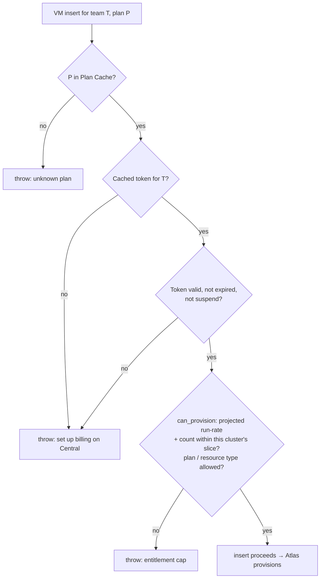

# Atlas → Agent integration

How Atlas resource lifecycle becomes billing events, and how Central's
directives (caps, suspension) act back on Atlas resources. Everything in this
chapter happens **in-process on the cluster-manager site** where `atlas` and
`press_billing_agent` are co-installed.

## The adapter

One module owns the whole mapping:

```
press_billing_agent/integrations/atlas.py
```

It is wired from the **Agent's** `hooks.py` via `doc_events` on Atlas
DocTypes (`Virtual Machine`, `Virtual Machine Snapshot`) and scheduler
entries. Atlas itself is untouched beyond the attribution fields below —
Atlas never imports `press_billing_agent`. If Atlas is not installed on the
site the hooks simply never fire, so the Agent remains installable standalone
(demo mode, `provisioning.py`).

## Attribution fields on Atlas resources

Billing needs two facts Atlas doesn't currently carry. Both are **opaque Data
fields to Atlas** — Atlas stores and copies them; only the Agent gives them
meaning:

| Field | On | Semantics | Set when |
| --- | --- | --- | --- |
| `team` | Virtual Machine, VM Snapshot | The Central Team identifier — same field the IAM contract already requires ([central/spec/IAM.md](../../central/spec/IAM.md), [Execution Plan §2](../../central/spec/EXECUTION_PLAN.md)). Immutable, indexed. | At creation; snapshots inherit from their VM |
| `plan` | Virtual Machine | The Central plan id the user chose — must exist in the Agent's `Plan Cache`. Mutable only through resize/plan-change (which the Agent observes as a `changed` event). | At creation; updated on plan change |

Decisions:

- **`resource_id` = `Virtual Machine.name`.** The VM's UUID is assigned at
  insert and never changes — including through stop/start, resize, and
  terminate ([atlas/spec/05](../../atlas/spec/05-virtual-machine-lifecycle.md#identity)).
  That is exactly the stable price-lock key Central needs. No separate
  billing id is minted.
- **`cluster` = the Atlas region** (the active Root Domain's region, e.g.
  `blr1`). The Agent reads it once from site config (`cluster` key) and
  stamps it on every event; it must match the cluster name Central uses in
  `Entitlement Token.cluster_slices` and `Catalog Rate.cluster`.
- **Plan ↔ size.** A plan's `includes_json` describes the resource shape
  (vCPU, memory, disk). The creation UI derives the VM's `size_preset` from
  the chosen plan; the Agent's gate validates the plan exists in the Plan
  Cache but does **not** re-derive or police the size mapping at launch
  (operator-created VMs without a plan stay possible — see "Unattributed
  resources" below).
- **Self-serve Sites bill through their backing VM.** A `Site`
  ([atlas/spec/14](../../atlas/spec/14-self-serve.md)) is a product
  wrapper around one cloned VM; the VM carries the team + plan and is the
  billed resource. Site-level plans are deferred.

## Lifecycle → event mapping

The Agent's `doc_events` on `Virtual Machine` translate lifecycle transitions
into `events.record_event(...)` calls (append-only `Plan Subscription Log`,
best-effort push to Central — recording never blocks on the push):

| Atlas transition | Billing event | Notes |
| --- | --- | --- |
| First successful provision (`Pending → Running`) | `subscribed` | `shown_rate` resolved from Plan Cache for (plan, currency, cluster) at this moment — the number the user saw. `effective_from` = provision success time, **not** insert time: a VM that never provisioned never bills. |
| Resize / plan change (Stopped-only in Atlas) | `changed` | Closes the open segment, opens a new one at the **new plan's current cached rate** — a plan change re-locks; only the unchanged plan is grandfathered ([plans-and-pricing.md](../plans-and-pricing.md)). |
| `terminate()` | `cancelled` | Closes the segment; billing for the resource ends at termination time. |
| Stop / Start / Pause / Resume | *(no event)* | See decision below. |
| Failed provision, retry | *(no event)* | Only the first transition to Running subscribes; the hook is idempotent on (resource_id, open segment). |

**Decision — stopped VMs keep billing at the full plan rate.** A stopped VM
still holds its disk LV, its IPv6 allocation, and its placement on the
server; only terminate releases them. So at launch, `subscribed … cancelled`
brackets the billable life of the VM and stop/start is billing-neutral (the
DigitalOcean model). The architecture line "a stopped machine bills
accordingly" ([architecture.md](../architecture.md))
is honoured in the model, not yet in pricing: a future storage-only stopped
rate would be expressed as a `changed` event to a derived plan on stop and
back on start — the event log already supports it, so this is a pricing
decision, not a schema change.

Hook idempotency: every hook re-checks current state before appending
(`subscribed` only if no open segment exists for the resource_id;
`cancelled` only if one does), so a re-fired doc event or a provision retry
never double-opens or double-closes a segment.

## The provision gate

`before_insert` on `Virtual Machine` (and the provision-retry path) enforces
the cached entitlement token — **offline, no Central call**:



- **Projected run-rate** = sum of `shown_rate` over the team's *open*
  segments in this cluster, plus the new plan's rate. `shown_rate` is in
  rate units (minor × 10⁶, [ADR 0003](../docs/adr/0003-money-as-integer-minor-units.md));
  the token's `max_spend` is in minor units — the gate divides by 10⁶ before
  comparing. The existing `entitlement.can_provision` compares whatever units
  the caller passes; the adapter owns the conversion.
- **Fallback:** token expired *and* Central unreachable → deny **new**
  provisions, never touch running ones
  ([provisioning-and-entitlements.md](../provisioning-and-entitlements.md)).
- The gate runs after the IAM capability check (`vm:create` for the team,
  [central/spec/IAM.md](../../central/spec/IAM.md)) — IAM answers "may this
  user act for this team"; the entitlement answers "may this team consume
  more".

## Enforcement of running resources

A Central directive arrives as the next pushed token (`suspend` /
`terminate` flags — same channel as caps,
[provisioning-and-entitlements.md](../provisioning-and-entitlements.md)).
The Agent's **hourly enforcement job** reconciles Atlas to
`entitlement.enforcement_state(team)`:

| State | Action on the team's VMs |
| --- | --- |
| `running` | Nothing. Also the state for an *expired* token — never punish customers for our outage. |
| `stopped` | `vm.stop()` every Running/Paused VM. Power-off, data preserved. |
| `terminated` | `vm.terminate()` every non-Terminated VM (fires the `cancelled` event through the normal hook). |

- Enforcement acts through the **normal Atlas controller methods**, so every
  action is one audited Atlas Task — the operator sees exactly what billing
  did and when.
- **Decision — enforcement overrides `stop_protection` / `termination_protection`.**
  Those gates are operator conveniences against accidents; a deliberate
  delinquency directive from Central must win. The job clears the flag and
  proceeds, and the Task + a comment on the VM record that enforcement did it.
- The job is idempotent and converging: it compares desired state to actual
  status and only acts on the difference, so a re-run after a partial failure
  finishes the remainder.

## Unattributed resources

VMs with no `team` (operator/legacy resources, proxy VMs, golden-image build
VMs) are **outside billing**: no events, no gate, operator-only visibility
per the IAM contract. The adapter skips any resource without a team — Atlas
remains fully usable as a pure operator tool on a site with no tokens at all.

## Testing

- Unit: the event mapping (each transition → expected event_type, idempotent
  re-fire), the gate's unit conversion and deny paths (no token / expired /
  suspended / cap exceeded / plan not allowed), the enforcement job's
  desired-vs-actual convergence and protection override — all with Atlas
  controller seams mocked.
- Integration (cluster site with both apps): provision → `subscribed` row →
  push acknowledged on a stub Central; terminate → `cancelled`; suspend token
  → VMs stopped with Task rows.
