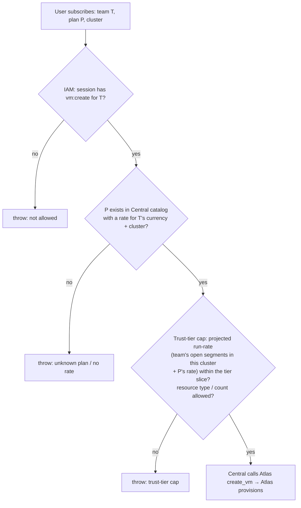

# Atlas ↔ Central integration

How Atlas resource lifecycle becomes billing events, and how Central's
directives (caps, suspension) act on Atlas resources. Everything here is
**Central calling Atlas's API** (and Atlas reporting status back) — there is no
per-cluster billing app. The mapping lives in one Central module:

```
central/billing/integrations/atlas.py
```

It is the only module that knows Atlas concepts. It exposes: the Atlas API
client (create / resize / terminate / stop / reads), the status-callback
receiver Atlas posts to, and the lifecycle→billing-event mapping. Atlas itself
is untouched beyond the attribution fields below and the API/callback seam —
**Atlas never imports `central` and holds no billing state.**

## Attribution fields on Atlas resources

Billing needs two facts Atlas doesn't otherwise carry. Both are **opaque Data
fields to Atlas** — Atlas stores, copies, and echoes them back to Central; only
Central gives them meaning:

| Field | On | Semantics | Set when |
| --- | --- | --- | --- |
| `team` | Virtual Machine, VM Snapshot | The Central Team identifier — same field the IAM contract already requires ([central/spec/IAM.md](../../central/spec/IAM.md), [Execution Plan §2](../../central/spec/EXECUTION_PLAN.md)). Immutable, indexed. | At creation (Central passes it on the create call); snapshots inherit from their VM |
| `plan` | Virtual Machine | The Central plan id the user chose. Opaque to Atlas; Central resolves the rate from its own catalog. Mutable only through resize/plan-change. | At creation; updated on plan change |

Decisions:

- **`resource_id` = `Virtual Machine.name`.** The VM's UUID is assigned at
  insert and never changes — including through stop/start, resize, and
  terminate ([atlas/spec/05](../../atlas/spec/05-virtual-machine-lifecycle.md#identity)).
  That is exactly the stable price-lock key Central needs. No separate billing
  id is minted. Central learns the UUID from the create call's response.
- **`cluster` = the Atlas region** (e.g. `blr1`). Central knows which cluster it
  called and stamps that on every event; it must match the cluster name used in
  the team's trust-tier slice and in `Catalog Rate.cluster`. Cluster identity is
  Central-side configuration of the Atlas endpoint, not a per-cluster app value.
- **Plan ↔ size.** A plan's `includes_json` describes the resource shape (vCPU,
  memory, disk). Central derives the VM's `size_preset` from the chosen plan and
  passes it on the create call; Atlas provisions that size. Operator-created VMs
  without a plan (created directly in Atlas) stay possible and unbilled — see
  "Unattributed resources".
- **Self-serve Sites bill through their backing VM.** A `Site`
  ([atlas/spec/14](../../atlas/spec/14-self-serve.md)) wraps one cloned VM; the
  VM carries the team + plan and is the billed resource. Site-level plans are
  deferred.

## Lifecycle → event mapping

Central drives the lifecycle (it initiates create/resize/terminate via the
Atlas API) and records the matching event. The trigger for `subscribed` is
Atlas's status callback on first `Running`; `changed`/`cancelled` are recorded
when Central issues the resize/terminate call and Atlas confirms. Each event is
an append-only event-log row plus a price lock (`subscribed`/`changed`):

| Atlas transition | Billing event | Notes |
| --- | --- | --- |
| First successful provision (`Pending → Running`, via status callback) | `subscribed` | `shown_rate` resolved from the Central Plan/Catalog Rate for (plan, currency, cluster) at this moment — the number the user saw. `effective_from` = provision-success time, **not** the create-call time: a VM that never provisioned never bills. |
| Resize / plan change (Stopped-only in Atlas) | `changed` | Closes the open segment, opens a new one at the **new plan's current rate** — a plan change re-locks; only the unchanged plan is grandfathered ([plans-and-pricing.md](../plans-and-pricing.md)). |
| `terminate()` (Central-initiated, or enforcement) | `cancelled` | Closes the segment; billing for the resource ends at termination time. |
| Stop / Start / Pause / Resume | *(no event)* | See decision below. |
| Failed provision, retry | *(no event)* | Only the first transition to Running subscribes; recording is idempotent on (resource_id, open segment). |

**Decision — stopped VMs keep billing at the full plan rate.** A stopped VM
still holds its disk LV, its IPv6 allocation, and its placement on the server;
only terminate releases them. So `subscribed … cancelled` brackets the billable
life of the VM and stop/start is billing-neutral (the DigitalOcean model). The
architecture line "a stopped machine bills accordingly"
([architecture.md](../architecture.md)) is honoured in the model, not yet in
pricing: a future storage-only stopped rate would be a `changed` event to a
derived plan on stop and back on start — the event log already supports it, so
that is a pricing decision, not a schema change.

Idempotency: recording re-checks current state before appending (`subscribed`
only if no open segment exists for the resource_id; `cancelled` only if one
does), so a duplicated status callback or a provision retry never double-opens
or double-closes a segment. Because Central holds the event log, this is a
local check — no cross-app coordination.

## The provision gate

The gate is **synchronous on Central, before it calls Atlas** — no token, no
offline check, no cluster round-trip for the decision:



- **Projected run-rate** = sum of `shown_rate` over the team's *open* segments
  in this cluster (which Central already holds, since Central records the event
  log) plus the new plan's rate, compared against the trust-tier cap for the
  cluster. Rates are in rate units (minor × 10⁶,
  [ADR 0003](../docs/adr/0003-money-as-integer-minor-units.md)); the cap is in
  minor units — the gate converts before comparing.
- **The cap is the trust tier, evaluated live from billing history** — not a
  cached signed token ([ADR 0006](../docs/adr/0006-agentless-central-owns-provisioning-and-enforcement.md)).
  Because the check is synchronous on Central, a tier promotion takes effect on
  the next provision with no re-issue/refresh step.
- The gate runs **after** the IAM capability check (`vm:create` for the team,
  [central/spec/IAM.md](../../central/spec/IAM.md)) — IAM answers "may this user
  act for this team", the gate answers "may this team consume more".
- **Central availability:** the gate (and therefore *new* provisioning) needs
  Central up. That is acceptable — provisioning is already a Central-initiated
  action, and an outage only delays new VMs; it never touches running ones.

## Enforcement of running resources

Delinquency comes from Central's own dunning ([#14](../issues/14-retry-dunning-suspension.md)),
not a pushed token. When dunning decides to suspend or terminate, Central's
Atlas client reconciles the team's Atlas VMs to the desired state by **calling
the Atlas API**:

| Dunning decision | Action on the team's VMs |
| --- | --- |
| `suspend` | `stop_vm()` on every Running/Paused VM. Power-off, data preserved. |
| `terminate` | `terminate_vm()` on every non-Terminated VM (records the `cancelled` event). |
| current / recovered | Nothing. Restarting a stopped VM is the customer's action. |

- Enforcement calls the **normal Atlas operations**, so every action is one
  audited Atlas Task — the operator sees exactly what billing did and when.
- **Decision — enforcement overrides `stop_protection` / `termination_protection`.**
  Those gates are operator conveniences against accidents; a deliberate
  delinquency directive from Central must win. The Atlas call clears the flag
  and proceeds, and the Task + a comment on the VM record that enforcement did
  it.
- **Central-unreachable never enforces.** Atlas acts only on an explicit Central
  call, so a Central outage can never stop a running resource — the
  outage-resilience property the old offline-token model existed to provide now
  holds *trivially*, because nothing on the cluster can decide to suspend.
- Reconciliation is idempotent and converging: Central compares desired state
  to the status it reads from Atlas and acts only on the difference, so a re-run
  after a partial failure finishes the remainder.

## Unattributed resources

VMs with no `team` (operator/legacy resources, proxy VMs, golden-image build
VMs, created directly in Atlas) are **outside billing**: no events, no gate, no
enforcement, operator-only visibility per the IAM contract. Central's status
callback ignores any resource without a team, so Atlas remains fully usable as a
pure operator tool on a cluster that Central has never provisioned into.

## Testing

- Unit (in Central, Atlas client mocked): the event mapping (each transition →
  expected event_type, idempotent re-fire / duplicate callback), the gate's unit
  conversion and deny paths (IAM denied / unknown plan / no rate / over
  trust-tier cap / resource type not allowed), and the enforcement
  desired-vs-actual convergence and protection override.
- Integration (Central + a stub Atlas API): subscribe → create call → `Running`
  callback → `subscribed` row + price lock; terminate → `cancelled`; suspend
  decision → Atlas `stop_vm` calls issued for each VM with Task ids returned.
