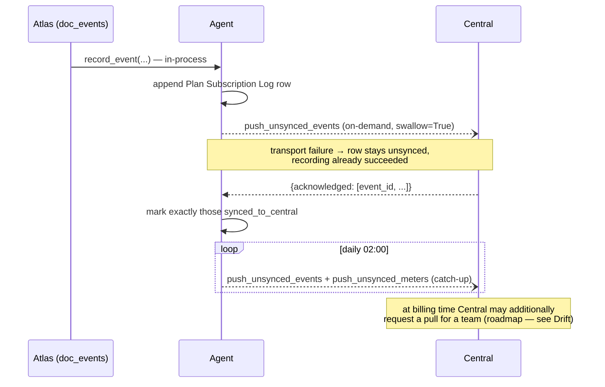

# Agent ↔ Central sync

The HTTP spine between each cluster's `press_billing_agent` and Central's
`billing` module. This is **built**; this chapter pins the canonical
contract and records the drift that must be fixed before the Atlas adapter
([01](./01-atlas-agent-integration.md)) goes live.

## Principles

- **Push-based, both directions.** The Agent never polls Central; Central
  never polls the Agent. Each side pushes when something changes, with a
  daily catch-up for anything unacknowledged.
- **Idempotent on stable keys.** Events on `event_id` (the log row name),
  meter rollups on `idempotency_key` (resource, meter, period — a re-push
  **replaces**), plan pushes on the plan name (upsert), tokens on the team
  (upsert). Any message can be re-sent safely.
- **Ack-exactly.** Central returns the list of keys it accepted; the Agent
  marks exactly those `synced_to_central`. A partial failure is retried, not
  silently dropped.
- **Cluster autonomy.** Provisioning, event recording, metering, and
  enforcement all work with Central unreachable; only onboarding (first
  token) and token refresh need Central.

## Canonical endpoints

| Direction | Endpoint (dotted method) | Payload | Built in |
| --- | --- | --- | --- |
| Central → Agent | `press_billing_agent.sync.receive_plans` | `{plans: [{plan, title, billing_cycle, rates, includes}]}` | `press_billing_agent/sync.py` |
| Central → Agent | `press_billing_agent.entitlement.receive_token` | `{team, payload, signature}` — verified offline | `press_billing_agent/entitlement.py` |
| Agent → Central | `central.billing.platform.sync.receive_usage_events` | `{events: [...]}` → `{acknowledged: [event_id]}`; each event locks a price (`revenue/pricelock.lock_from_event`) | `central/billing/platform/sync.py` |
| Agent → Central | `central.billing.platform.sync.receive_meter_rollups` | `{meters: [...]}` → `{acknowledged: [idempotency_key]}` (`revenue/metering.ingest_rollup`) | `central/billing/platform/sync.py` |

Auth: token auth with dedicated, least-privilege API users —
Central→Agent calls use the cluster-scoped key in Central's site config
(`agent_api_key`/`agent_api_secret`, one per cluster); Agent→Central calls
use `central_api_key`/`central_api_secret` in the Agent's site config. The
Agent's credentials must not reach customer or admin billing endpoints.

## Push cadence

1. **On-demand** the moment a change is recorded (near-realtime; failure
   swallowed and logged to Sync Log).
2. **Daily catch-up** at 02:00 for anything unacknowledged (already wired in
   the Agent's `scheduler_events`, alongside Sync Log pruning).
3. **Billing-time pull** (`get_team_usage`) is in the v2 spec but not built;
   it is a verification/repair path, not the primary flow.

## What Central does with the pushes

- **Events → Price Lock.** `lock_from_event` is idempotent on `event_id`;
  the locked `shown_rate` for a `resource_id` is what invoicing joins
  against — grandfathering falls out of locking at `subscribed`/`changed`
  time ([plans-and-pricing.md](../plans-and-pricing.md)).
- **Rollups → Usage Rollup.** Bounded store, replace-on-re-push; the open
  period's running total drives the customer forecast and collapses to the
  final figure at close ([metering.md](../metering.md)).
- On the 1st, invoicing reads segments + locks + rollups; nothing in the
  invoice run calls a cluster ([invoicing.md](../invoicing.md)).

## Drift to fix (blocking the Atlas adapter)

1. **Agent push paths are stale — FIXED.** `press_billing_agent/sync.py`
   used to post to `/api/method/press_billing.sync.receive_usage_events`
   (and `…receive_meter_rollups`); it now posts to the canonical
   `central.billing.platform.sync.*` paths above, where Central exposes the
   receivers since billing merged into Central as a module
   ([ADR 0004](../docs/adr/0004-billing-as-central-module-capability-iam.md)).
   The standalone `billing` app (`billing.platform.sync.*`) is the pre-merge
   copy. The v2-spec names (`cloud_billing.sync.*`, `subscription_agent.*`)
   are the same seams under pre-merge naming.
2. **`Virtual Machine.team` doesn't exist yet.** The IAM contract and
   [Execution Plan §2](../../central/spec/EXECUTION_PLAN.md) require it; the
   billing adapter keys everything on it.
3. **`get_team_usage` (billing-time pull) is unbuilt** — acceptable for
   launch given push + catch-up, but the invoice run should record per-team
   "data as of" so a stalled Agent is visible
   ([observability.md](../observability.md)).
4. **Cluster identity is implicit.** Events carry `cluster` per-row from the
   caller; the Agent needs the single site-config `cluster` value (chapter
   01) so Atlas-originated events and Central's `cluster_slices` agree on
   the name.
