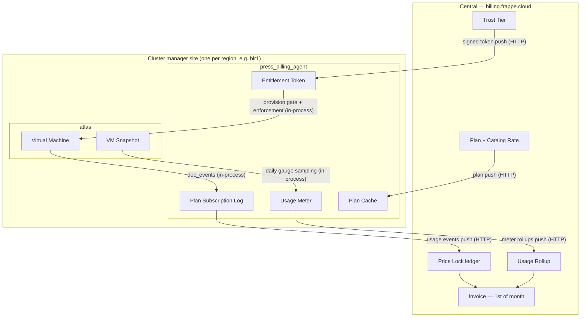

# Atlas Integration — Atlas → Agent → Central

How a Firecracker VM managed by Atlas becomes a line on a Central invoice.
This spec covers the **workflow and integration seams** between the three
systems; the billing domain itself (money, invoicing, payments, credits, tax)
is specced by the domain files in this repo ([README](../README.md)) and the
VM/cluster domain in [atlas/spec](../../atlas/spec/README.md). Central IAM
(Teams, capabilities, OAuth) is specced in
[central/spec/IAM.md](../../central/spec/IAM.md).

## The three systems

| System | App | Where it runs | Authoritative for |
| --- | --- | --- | --- |
| Central | `central` (incl. the `billing` module) | `billing.frappe.cloud` (one, global) | Intent + money: plans, price locks, invoices, payments, credits, trust tiers, Teams |
| Billing Agent | `press_billing_agent` | each cluster-manager site, **co-installed with Atlas** | What actually ran: the plan-change event log, metered rollups, cached plans, cached entitlement tokens |
| Atlas | `atlas` | each cluster-manager site | The resources themselves: Servers, Virtual Machines, Snapshots, Sites, Tasks |

In the v2 billing specs the per-cluster role is called the "Subscription
Agent" and the resource manager the "Bench Manager". In this deployment the
Subscription Agent **is** `press_billing_agent` and the Bench Manager **is**
Atlas.

## The picture

Two transport regimes, on purpose:

- **Atlas ↔ Agent: in-process.** Both apps are installed on the same
  cluster-manager site. The integration is Frappe `doc_events` hooks plus
  direct Python calls — no HTTP, no auth surface, no partial-failure window
  between "the VM exists" and "billing knows".
- **Agent ↔ Central: HTTP, push-based, idempotent.** Already built. The
  cluster keeps working when Central is down; everything unacknowledged is
  re-pushed by the daily catch-up.

## The layering rule

**Atlas never imports billing.** Atlas sits below everything
([atlas/spec/01-architecture.md](../../atlas/spec/01-architecture.md));
its only billing-relevant contribution is carrying two opaque attribution
fields (`team`, `plan`) on its resources. The Agent depends on Atlas — it
registers `doc_events` against Atlas DocTypes and calls Atlas controller
methods for enforcement — never the reverse. All mapping from "Atlas did X"
to "billing event Y" lives in one adapter module inside the Agent.

## End-to-end walkthrough

1. **Catalog.** An admin defines a `Plan` + `Catalog Rate`s on Central and
   pushes them to each cluster (`push_plans_to_agent` → Agent `Plan Cache`).
2. **Onboarding.** A user signs up on Central, creates/joins a Team, adds a
   payment method. Central computes the Team's `Trust Tier` and pushes a
   signed `Entitlement Token` to each allowed cluster. Onboarding requires
   Central; steady-state does not.
3. **Provision.** The user (authenticated into Atlas via Central OAuth,
   [central/spec/IAM.md](../../central/spec/IAM.md)) creates a Virtual
   Machine for a Team on a plan. The Agent's `before_insert` hook gates it
   against the cached token (projected run-rate vs the cluster slice cap) —
   offline, no Central call.
4. **Subscribed event.** When the VM first provisions successfully, the
   Agent appends a `subscribed` row to the `Plan Subscription Log` —
   `resource_id` = the VM's UUID, `shown_rate` = the rate the user saw,
   resolved from the Plan Cache — and best-effort pushes it to Central,
   where it becomes a Price Lock (the rate is grandfathered).
5. **Usage.** Resize → `changed` event (re-lock at the new plan's current
   rate). Terminate → `cancelled` event (segment closed). Snapshots are
   sampled daily into a gauge meter (GB-days); transfer accumulates into a
   counter meter. Rollups push to Central.
6. **Invoice.** On the 1st, Central joins event-log segments to locked rates,
   adds metered lines from rollups, and bills the month just ended — pure
   postpaid ([invoicing.md](../invoicing.md)).
7. **Delinquency.** Retries fail → Central pushes a token with `suspend`
   (later `terminate`). The Agent's enforcement loop stops (later terminates)
   the Team's VMs via normal Atlas controller calls — each action is an
   audited Atlas Task. Central unreachable ≠ delinquent: an *expired* token
   never stops running resources.

## Spec chapters

- [01-atlas-agent-integration.md](./01-atlas-agent-integration.md) — the
  adapter: attribution fields, lifecycle-event mapping, provision gate,
  enforcement loop.
- [02-agent-central-sync.md](./02-agent-central-sync.md) — the HTTP spine:
  canonical endpoints, auth, idempotency, and current path drift to fix.
- [03-metering.md](./03-metering.md) — Atlas usage sources mapped onto the
  counter/gauge meters.

## Status

The Agent ↔ Central spine, the Agent's event log / meters / token
verification, and Central's price-lock + rollup ingestion are **built**
(`press_billing_agent/sync.py`, `central/billing/platform/sync.py`,
`central/billing/revenue/pricelock.py`, `revenue/metering.py`). The
Atlas ↔ Agent adapter specced in chapter 01 is **not built** — today the
Agent's `provisioning.py` mints simulated `srv-<team>-N` resource ids; it is
superseded by this spec and retained for demos only. Chapter 02 lists the
known drift (endpoint paths, VM `team` field) that must land first.

Implementation is broken into tracer-bullet issues
[#50–#59](../issues/README.md#atlas-integration-milestone-at)
(the **AT** milestone).
