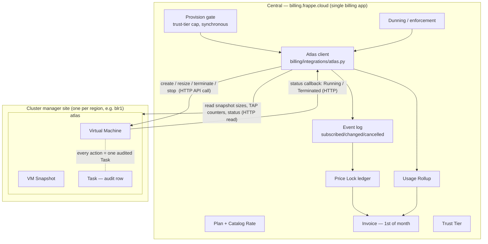

# Atlas Integration — Central ↔ Atlas

How a Firecracker VM managed by Atlas becomes a line on a Central invoice.
This spec covers the **integration seam** between the two systems; the billing
domain itself (money, invoicing, payments, credits, tax) is specced by the
domain files in this repo ([README](../README.md)) and the VM/cluster domain
in [atlas/spec](../../atlas/spec/README.md). Central IAM (Teams, capabilities,
OAuth) is specced in [central/spec/IAM.md](../../central/spec/IAM.md).

> **Agentless ([ADR 0006](../docs/adr/0006-agentless-central-owns-provisioning-and-enforcement.md), 2026-06-15).**
> There is **no per-cluster Subscription Agent**. The earlier design put a
> second Frappe app (`press_billing_agent`) on every cluster to hold a local
> event log, meters, cached plans, and a signed entitlement token. That app is
> retired. **Central is the single billing application**: it provisions, records
> usage, and enforces by calling Atlas's API directly, and it reads runtime
> state back from Atlas. No Plan Cache, no Sync Log, no Entitlement Token, no
> offline verification, no push/ack spine.

## The two systems

| System | App | Where it runs | Authoritative for |
| --- | --- | --- | --- |
| Central | `central` (incl. the `billing` module) | `billing.frappe.cloud` (one, global) | Intent + money **and the recorded runtime it bills from**: plans, price locks, the event log, metered rollups, invoices, payments, credits, trust tiers, Teams |
| Atlas | `atlas` | each cluster-manager site (one per region) | The resources themselves: Servers, Virtual Machines, Snapshots, Sites, Tasks. The **executor** Central calls, and the source of the runtime state Central reads |

In the v2 billing specs the resource manager is called the "Bench Manager"
(a.k.a. *cluster manager*). In this deployment the Bench Manager **is** Atlas.
There is no third role: what the retired Subscription Agent used to do now
lives **inside `central/billing`** as an Atlas client module.

## The picture



One transport regime, one direction of control:

- **Central → Atlas: HTTP API, Central is the client.** Central calls Atlas to
  create / resize / terminate / stop a VM and to read runtime facts (status,
  snapshot sizes, transfer counters). Atlas exposes a least-privilege API for
  this; it never imports billing and never decides what to bill.
- **Atlas → Central: a thin status callback.** When a VM reaches `Running` or
  is terminated, Atlas posts the transition to Central so Central can stamp the
  event at the right moment (`effective_from` = provision-success). This is the
  cluster manager *reporting its own state*, not a billing app — Atlas holds no
  billing records. If the callback is missed, Central's reconciliation read
  (chapter [02](./02-central-atlas-api.md)) repairs it; recording never depends
  on Atlas calling first.

**Central writes the price lock and the event the moment it provisions** — the
rate the user saw and the rate locked are guaranteed equal because the *same
Central component* shows the rate, calls Atlas, and records the lock. There is
no second source of truth on the cluster to drift from.

## The layering rule

**Atlas never imports billing.** Atlas sits below everything
([atlas/spec/01-architecture.md](../../atlas/spec/01-architecture.md)); its
only billing-relevant contribution is carrying two opaque attribution fields
(`team`, `plan`) on its resources and exposing an API for lifecycle + reads.
The dependency runs **one way: Central depends on Atlas** — Central's Atlas
client calls Atlas's API and reads Atlas documents; Atlas knows nothing of
Central beyond the status-callback URL it is configured to post to. All mapping
from "Atlas did X" to "billing event Y" lives in one module inside Central:
`central/billing/integrations/atlas.py`.

## End-to-end walkthrough

1. **Catalog.** An admin defines a `Plan` + `Catalog Rate`s on Central. Central
   holds them — there is no plan push and no per-cluster Plan Cache.
2. **Onboarding.** A user signs up on Central, creates/joins a Team, adds a
   payment method. Central computes the Team's `Trust Tier`. No token is issued
   or pushed.
3. **Provision.** The user subscribes to a plan on Central. Central runs the
   **provision gate synchronously** (IAM `vm:create` for the team, then the
   trust-tier cap vs the team's projected run-rate) and, if it passes, calls the
   **Atlas API** to create the Virtual Machine for that team on that plan.
4. **Subscribed event.** Atlas provisions (async) and, on `Pending → Running`,
   calls back to Central. Central appends a `subscribed` row to the event log —
   `resource_id` = the VM's UUID, `shown_rate` = the rate the user saw — and
   writes the matching **Price Lock** (the rate is grandfathered). Same
   component, so shown rate ≡ locked rate.
5. **Usage.** Resize → Central calls Atlas resize and records a `changed` event
   (re-lock at the new plan's current rate). Terminate → Central calls Atlas
   terminate and records a `cancelled` event (segment closed). Snapshots are
   sampled daily by **Central reading Atlas** into a gauge meter (GB-days);
   transfer accumulates into a counter meter the same way.
6. **Invoice.** On the 1st, Central joins event-log segments to locked rates,
   adds metered lines from rollups, and bills the month just ended — pure
   postpaid ([invoicing.md](../invoicing.md)). The invoice run touches no
   cluster; it reads Central's own records.
7. **Delinquency.** Retries fail → Central's **dunning** calls the Atlas API to
   stop (later terminate) the team's VMs — each a normal, audited Atlas Task.
   **Central-unreachable never stops anything**: Atlas only acts on an explicit
   Central call, so an outage can never suspend a running resource.

## Runtime flows

**The money path — VM lifecycle → invoice:**

```
 user picks Team + Plan on Central, clicks Create VM
        │
        ▼
 [central] provision gate ──── IAM denied / over trust-tier cap ──▶ ✗ throw
        │ ok (synchronous, against Central's own records)
        ▼
 [central] Atlas client → POST atlas create_vm(team, plan, size)
        │
        ▼
 [atlas] VM inserted (Pending) → auto_provision job → SSH provision-vm.py → Running
        │
        ▼  status callback (Pending→Running) ──HTTP──▶ [central] receive_vm_status
        │                                                  │ record_event("subscribed",
        │                                                  │   resource_id=VM UUID,
        │                                                  │   shown_rate ← Plan, cluster)
        │                                                  │ lock_from_event → PRICE LOCK
        ▼                                                  ▼ (rate grandfathered)
        (later: resize → Central records "changed" re-lock · terminate → "cancelled")
        │
 [central] 1st of month: segments × locked rates + meter rollups → INVOICE (postpaid)
```

**The enforcement path — delinquency, same direction of control:**

```
 [central] payment retries fail (dunning, #14)
        │   reconcile desired vs actual by reading Atlas state
        ▼
 [central] Atlas client →  suspend  : POST atlas stop_vm()      each Running VM
                           terminate: POST atlas terminate_vm() → "cancelled" event
        │                                  every call = one audited Atlas Task
        ▼
 Central unreachable → nothing happens (Atlas only acts on a Central call)
```

## Project structure

The integration lives **entirely in Central** — there is no second app to
deploy per cluster. The Atlas-facing code is one module plus the existing
revenue/enforcement modules it feeds:

```
central/
└── central/billing/
    ├── integrations/
    │   └── atlas.py        # the whole Atlas seam: API client (create/resize/
    │                       #   terminate/stop + reads), the lifecycle→event
    │                       #   mapping, and the status-callback receiver.
    │                       #   The ONLY module that imports Atlas concepts.
    ├── revenue/
    │   ├── pricelock.py    # writes the price lock at provision time (subscribed/changed)
    │   └── metering.py     # gauge/counter rollups, sampled from Atlas reads
    ├── platform/
    │   └── provisioning.py # the provision gate (trust-tier cap, synchronous) + dunning enforcement
    └── ...                 # invoicing, payments, credits, tax — unchanged, cluster-agnostic
```

`atlas` is untouched beyond the attribution fields and the API/callback seam
([full spec](../../atlas/spec/README.md)):

```
atlas/
├── spec/                   # 14-chapter spec — the source of truth for Atlas
├── scripts/                # one idempotent script per operation, run over SSH
└── atlas/
    ├── atlas/
    │   ├── doctype/        # 22 DocTypes; the billing-relevant ones:
    │   │   ├── virtual_machine/           # core aggregate — UUID name = billing resource_id; carries team + plan
    │   │   ├── virtual_machine_snapshot/  # LVM CoW snapshots (→ gauge metering)
    │   │   └── task/                      # every SSH script run = one audit row
    │   └── api/            # the least-privilege endpoints Central's client calls
    └── frontend/ www/      # operator/user dashboards
```

## Spec chapters

- [01-atlas-central-integration.md](./01-atlas-central-integration.md) — the
  Atlas client: attribution fields, lifecycle-event mapping, the synchronous
  provision gate, the enforcement calls.
- [02-central-atlas-api.md](./02-central-atlas-api.md) — the seam: the Atlas
  API Central calls, the status callback, auth, idempotency, and reconciliation.
- [03-metering.md](./03-metering.md) — Atlas usage sources sampled by Central
  onto the counter/gauge meters.

## Status

Central's billing core (event log, price lock, meters, invoicing, payments) is
**built** in `central/billing`. What this milestone adds is the
`central/billing/integrations/atlas.py` seam — the Atlas API client, the
status-callback receiver, and the sampling reads — plus the two attribution
fields on Atlas. The retired Agent's simulated `srv-<team>-N` provisioning is
gone; real provisioning is a Central → Atlas API call.

Implementation is broken into tracer-bullet issues
[#50–#59](../issues/README.md#atlas-integration-milestone-at) (the **AT**
milestone).
