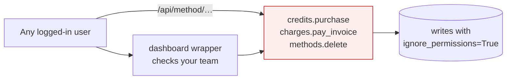
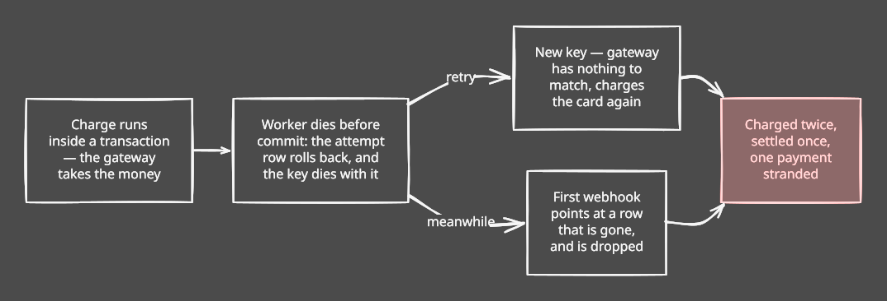
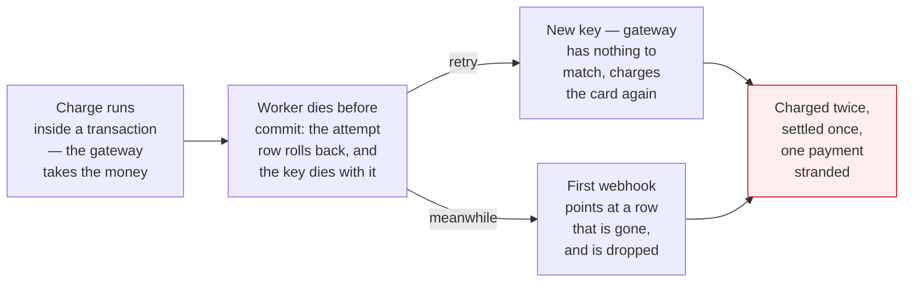
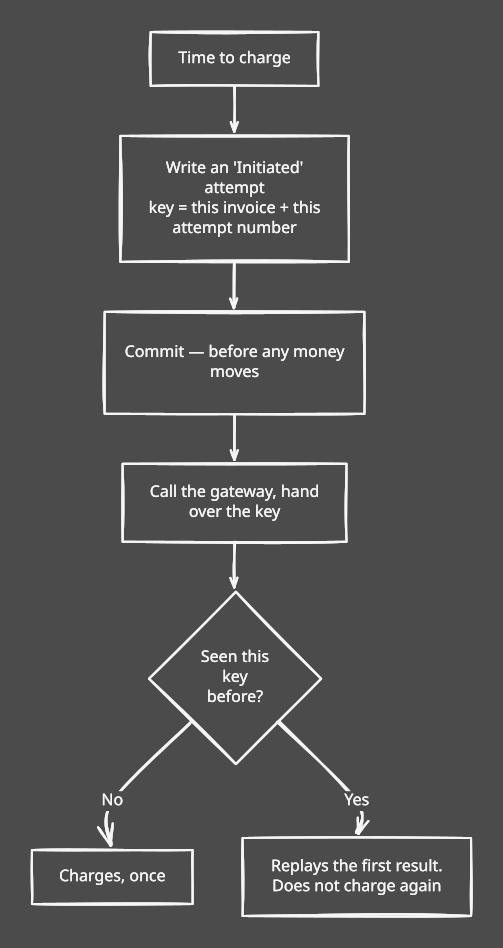
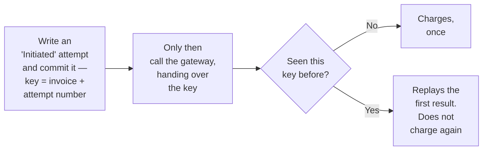

# Money is safe

*Billing, under the hood — part 1 of three. [Overview](billing-improvements-explained.md) · **Money is safe** · [It holds at scale](billing-02-it-holds-at-scale.md) · [We can prove it](billing-03-we-can-prove-it.md)*

---

Two of the ten things we found were about money moving when it shouldn't, or moving twice.
Neither had happened. Both could have.

## Ten unlocked doors

The first finding had nothing to do with money moving incorrectly. It was that quite a lot
of it could be moved by anyone who asked.

`@frappe.whitelist()` authenticates. It does not authorize. We had it on the billing
service primitives — mint credits, charge a card, delete a payment method, author a plan —
and the guarded dashboard wrappers around them checked the caller's team properly. But the
primitives carried the decorator themselves, so they were reachable directly, going around
the wrapper that did the checking.

diagram source

The permission layer that should have caught it was disabled by design: every primitive
writes with `ignore_permissions=True`, which is right for internal code and disastrous for
something exposed over HTTP. Ten findings, one root cause.

The fix was cheap because no internal caller depended on the decorator — each primitive was
called as a plain Python function by its wrapper, a sibling module, or a test. The
decorator came off, and the rule became: only `billing/api/**` may be whitelisted.

Two needed more. Top-up confirmation is legitimately reachable, and on the Razorpay path it
credited the amount the *client* sent rather than the amount the gateway captured. And
eleven places switched the session to Administrator without switching back, so later
permission-sensitive code in the same request ran as an admin.

A test now fails the build if `@frappe.whitelist` appears outside the API layer. We wrote
the guard before the fixes, which found two we had missed.

---

## The dangerous moment

Every charge has a window where we are blind: we have asked the gateway for the money and
have not heard back. A second or two, in which a worker can be killed by a deploy.

The charge ran *inside* a database transaction. So if the worker died before the commit,
the Payment Attempt row ceased to exist — while the gateway had still taken the money.

Worse, the idempotency key that stops double charges was the attempt row's own random ID.
Roll back the row, lose the key.

diagram source

And it was undetectable: reconciliation finds stranded charges by walking the attempt rows
that exist. A rolled-back row is invisible to it. Our safety net had a hole in exactly the
shape of the failure.

The gateway call moved *out* of the transaction, and now sits between two of them.

diagram source

The key is derived from two facts that cannot change — which invoice, which attempt number.
Never random, which is the whole point. After a crash the Initiated row survives, so we know
what was in flight; a retry reuses the same key and the gateway replays its first answer.

The same key does two jobs. Replaying an uncertain attempt is safe because the key is
unchanged. A genuinely new attempt — tomorrow's retry after a real decline — gets the next
attempt number, a new key, a real new charge. No ambiguity in between.

We also stopped treating our own call returning as proof. Paid means the gateway said so,
or reconciliation established it. (ADR 0017.)

---

## Next

The charging path is safe now, but safe and *fast* are different problems — and the monthly
run was still one long queue. That's [part two](billing-02-it-holds-at-scale.md).
