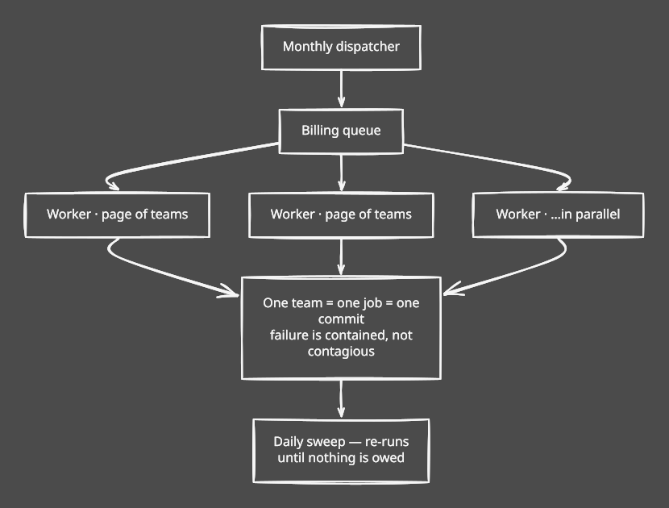
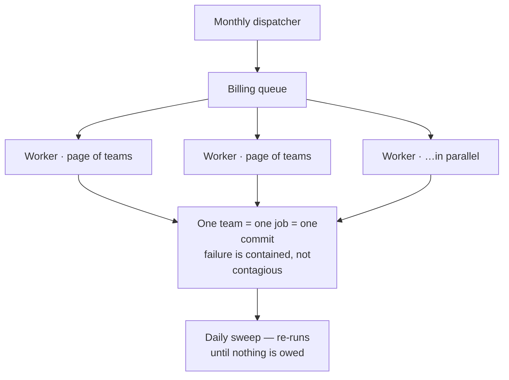
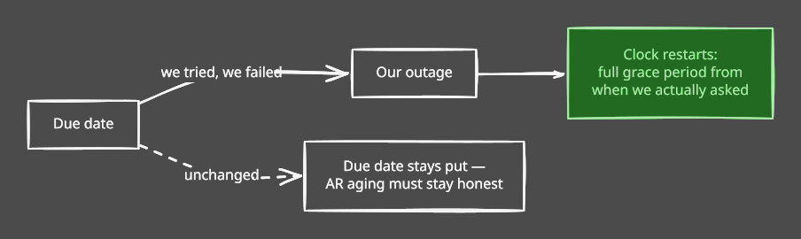
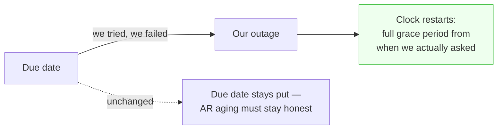
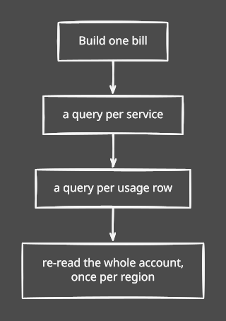
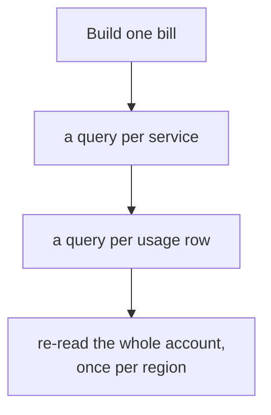
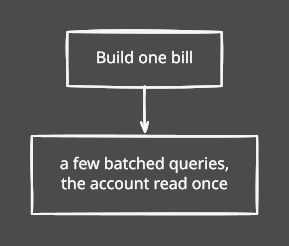
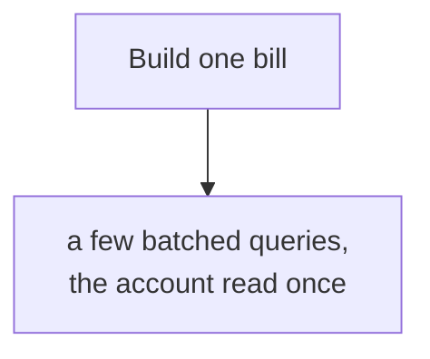

# It holds at scale

*Billing, under the hood — part 2 of three. [Overview](billing-improvements-explained.md) · [Money is safe](billing-01-money-is-safe.md) · **It holds at scale** · [We can prove it](billing-03-we-can-prove-it.md)*

---

[Part one](billing-01-money-is-safe.md) made charging safe. This part is about doing it
fifty thousand times in a night — and about one change that was not about correctness at
all.

## One long line

The monthly run did everything in one job, in order: draft every team, then collect every
invoice, including the slow gateway round trip on each. At ~2s per collected invoice, fifty
thousand teams is over a day in a single process — and one bad team blocks everyone behind
it.

We rebuilt it while it was still comfortably fast, which is the only sensible time to.

diagram source

Progress is read from the tables, not a counter in memory: a counter starts lying the
moment a worker dies. So a half-finished run is visible and simply resumes — safely,
because of the idempotency work above.

Two mistakes worth recording:

**Collecting once, a few hours after drafting.** Fine today, wrong at scale — the draft
jobs may still be running, so the scan collects what happens to exist and orphans the rest,
with no later pass to catch them. It's a daily sweep now.

**One job per team.** The obvious design, and it dies at a million teams: a million queued
messages that neither finish in time nor fit in memory. Pages of teams work.

---

## We failed to ask, so they aren't late

One change here wasn't about correctness.

The dunning ladder — retries, overdue notice, suspension — counted from the due date. Fine,
until the reason we didn't collect is *us*: the gateway rate-limited us, the run backed up,
a worker died mid-charge.

diagram source

The clock only moves forward, and a successful attempt stops pushing it, so a permanently
broken gateway defers *escalation*, not collection. The due date is untouched: what a
customer owed and when is an accounting fact.

---

## Hundreds of small questions

Fanning work out only helps if one bill is cheap. Ours wasn't.

**Before** — one bill meant a query per service, another per usage row, and the whole
account re-read once for every region the team runs in.

diagram source

**After** — the same bill, in a handful of batched queries.

diagram source

Metered pricing is resolved once per resource type instead of once per usage row. And we
added the indexes the hot money tables never had — looking up a payment attempt by gateway
transaction ID had none, so **every webhook settlement and every reconciliation sweep was a
full table scan**.

Rewriting how money is computed is exactly the change that introduces a quiet discrepancy.
So there's a test that builds a real multi-region bill the old way and the new way and
asserts identical lines. The speed-up doesn't move a paisa, and we can show it.

---

## Measuring instead of guessing

Every throughput number we'd quoted was arithmetic: 2s per invoice × 50k teams ÷ 20
workers. Reasonable, and not the same as knowing.

So we built a seeded run — N teams, real subscriptions — that asserts three things: it
stayed inside a per-team time budget, no money invariant broke, and a run killed half way
through and restarted produces exactly one invoice per team. N is an environment variable,
so the same test is a fast guard by default and a load run before a release.

At a thousand teams: **~14ms per team to draft**, single process. Against the 2 seconds we'd
been assuming for that half.

The budget is set far above the measurement on purpose. It isn't a benchmark — it's there
to catch someone reintroducing a per-team query.

We have not run it at fifty thousand teams. We now have the tool to.

---

## Next

Fast and correct still leaves the question of whether anyone can *trust* it. That's
[part three](billing-03-we-can-prove-it.md).
