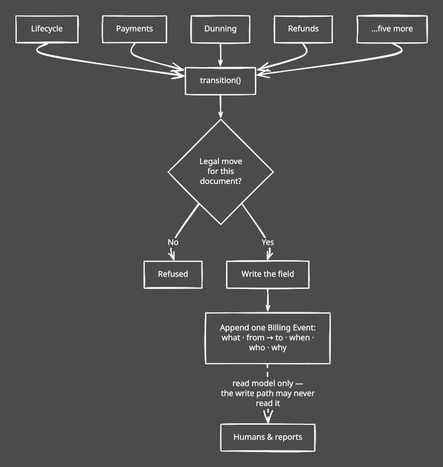
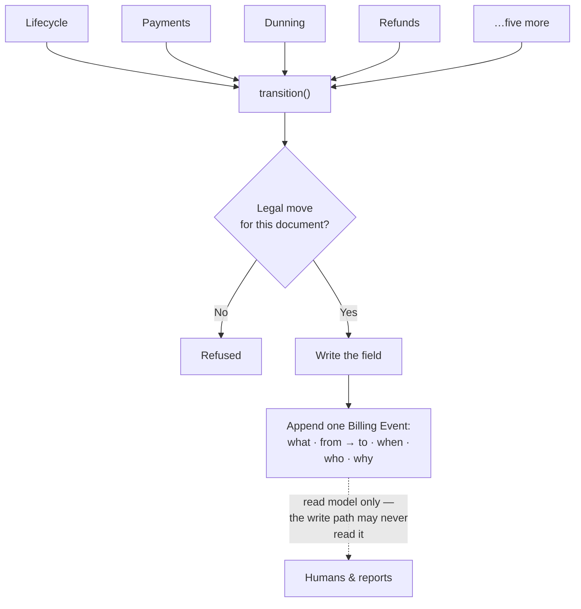
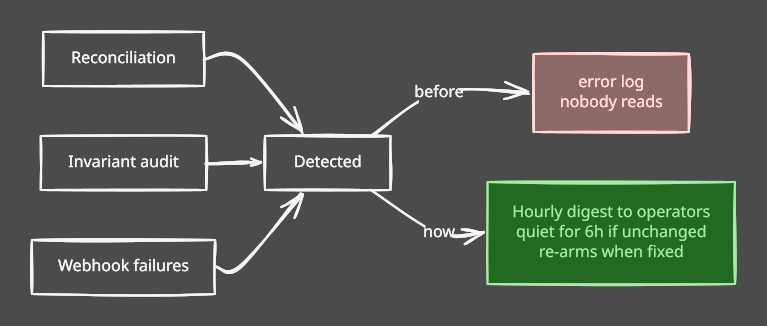
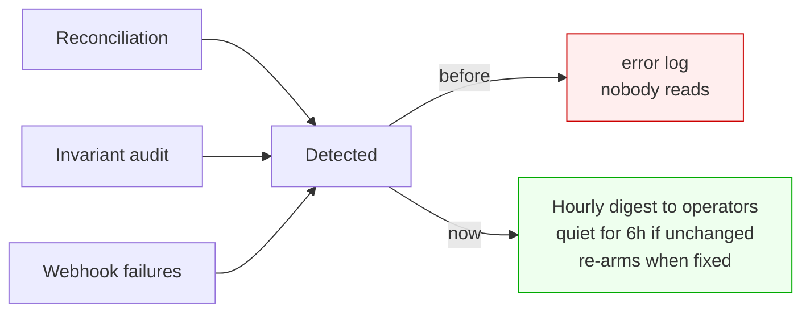
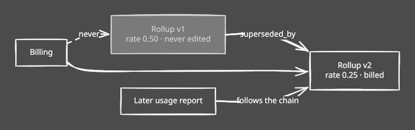
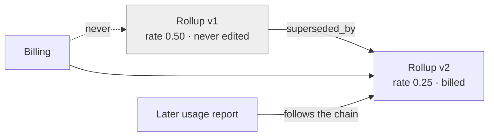
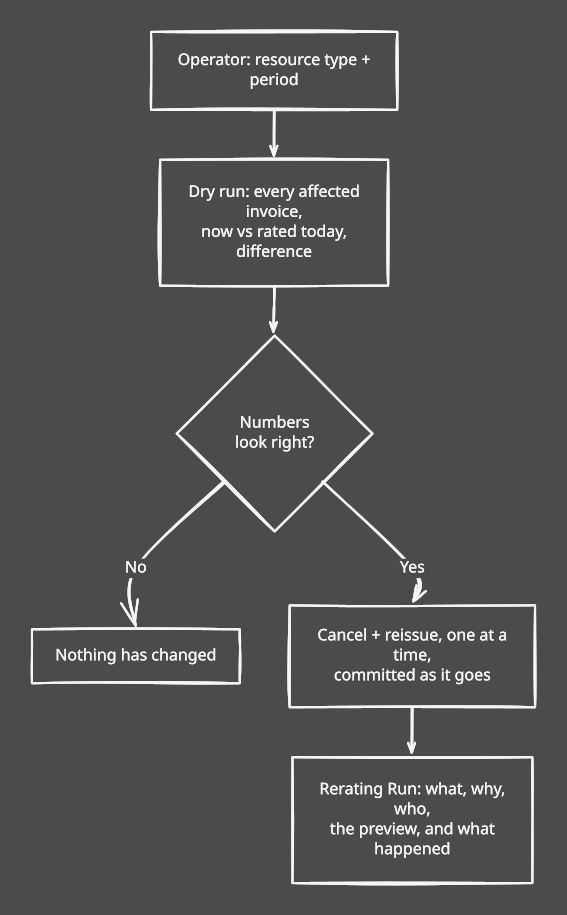
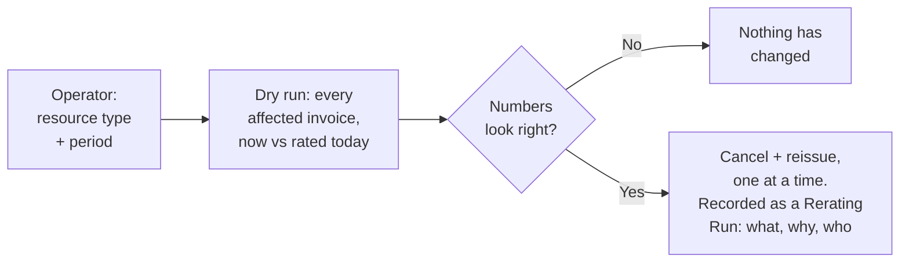

# We can prove it

*Billing, under the hood — part 3 of three. [Overview](billing-improvements-explained.md) · [Money is safe](billing-01-money-is-safe.md) · [It holds at scale](billing-02-it-holds-at-scale.md) · **We can prove it***

---

Charging is safe ([part one](billing-01-money-is-safe.md)) and the run holds up
([part two](billing-02-it-holds-at-scale.md)). What was left is the part that decides
whether anyone can trust either claim: who owns a bill's state, who finds out when
something breaks, and what happens when a price turns out to be wrong.

## Everyone had a key

Seven status fields — invoice, payment attempt, payment method, refund, webhook event,
account standing, commitment — and nothing owned any of them. Nine modules wrote statuses
directly.

Invoice status alone was set from two places that didn't know about each other. Nothing
prevented paying a cancelled invoice or reopening a paid one. And nothing recorded what
happened in order, so "why wasn't this customer charged?" meant joining six tables by
timestamp and hoping they agreed.

diagram source

The stream is one-way on purpose: drop the table and not one invoice total changes, so it
can never become a second source of truth that disagrees with the first.

Two subtleties. A repeated transition is *already done*, not an error — a duplicate
webhook, a reconciliation replay and dunning re-applying a standing all describe the same
outcome. And the log stores the document's *name*, not a link: a link was already blocking
deletion of a payment method. An audit trail has to outlive what it audits.

A test fails the build on any status write that bypasses the authority. The exception list
is empty. (ADR 0016.)

---

## The sweeps that told nobody

We had three standing controls — reconciliation, the invariant audit, webhook failure
recording. All three worked. None told a human anything; they wrote to a log somebody
would have to think to go and read.

diagram source

Each run phase now emits its counters — drafted, skipped, failed, settled, duration — as
one parseable line, and each period gets a durable Billing Run row. That row is re-derived
from the tables on every refresh rather than accumulated, for the same reason the run reads
its own progress from the data.

The pager covers three things the sweeps can detect but not fix: an invariant that no
longer holds, a webhook failed over an hour, an attempt still in flight a day after
reconciliation should have answered it. A digest, not one mail per row — alert fatigue is
how real alerts get ignored.

Four new views on data we already had: webhook lag, dunning recovery, involuntary churn,
and gateway auth rate as a trend rather than a number. The last three read off the Billing
Event stream — its first real use as a read model — so they only see transitions since the
stream began. Better an honest horizon than a guessed history.

---

## When the price was wrong

Sooner or later a rate is wrong and the month is already billed. Our answer was editing
rows by hand, which is the answer that ends up in a post-mortem.

Each usage rollup carries the rate and allowance locked when it was first received — that
grandfathering is what makes a metered charge auditable months later. Editing it in place
destroys the property it exists for. So a correction writes a new version:

diagram source

Re-issuing works the same way — nothing is edited, everything is recorded:

diagram source

Paid invoices are excluded. Money already taken is a refund's problem, and rewriting a bill
somebody has paid isn't a correction.

---

## What we haven't done

**The suite is not green, and this work didn't make it green.** 28 failures and 5 errors of
943 tests — exactly where it stood before. Most are fixture pollution between test classes:
metered plan fixtures cleaned up by one test, missing for the next, so the failure travels
with the ordering. Fixable, and a day's work of its own. Until then "green" can't be a merge
gate and we should stop pretending it is.

**One red is a real bug we left red.** A disabled subscription — paused, or on a terminated
machine — still counts toward the team's run rate, so it still consumes the headroom that
decides whether they can launch anything new. The obvious fix breaks something real:
subscriptions are created disabled and only enabled once the machine is running, so
filtering them out lets a team provisioning several at once sail past their spend cap.
That's a product decision about whether a pending machine consumes headroom, and we'd
rather leave the question open than paper over it.

**Money arithmetic is still floating point.** One module, decimal, one rounding policy at
line level, plus an assertion that subtotal equals the sum of lines. Designed, unwritten,
and the largest correctness item outstanding.

**Durable intent covers card charges only.** Payment orders, top-up captures and the
provisioning call still hand-roll commit and rollback for the same underlying reason. The
pattern is proven; it hasn't been carried across.

**A finished invoice's amounts can still be edited.** The field lock that would make
cancel-and-reissue the only correction path is designed and unwritten — as is our retention
policy, which the system already follows but nobody has written down.

---

## What we took from it

**Fix a scaling design while it's still comfortably fast.** Every change here was easy this
month and would have been an incident later. None were urgent. That's why they went well.

**A property no machine enforces is one you're slowly losing.** Two build-breaking guards,
two daily sweeps, an hourly page, an equivalence test. Not distrust — none of us will
remember any of this in eighteen months.

**Write down the reasoning, not the conclusion.** The code says what it does. What it can't
tell you is what we were afraid of.

None of this adds anything a customer can see. That's the point.
