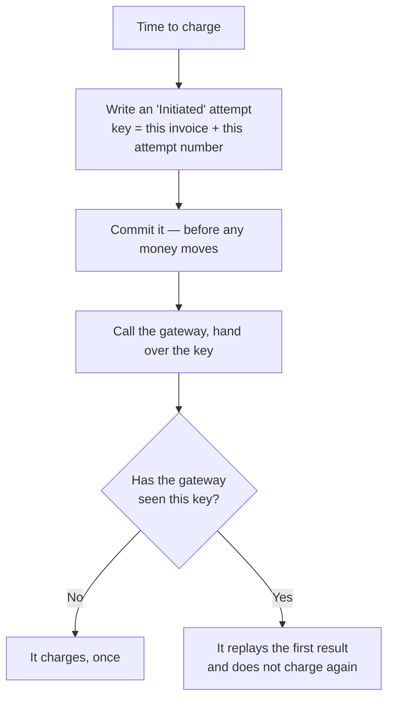
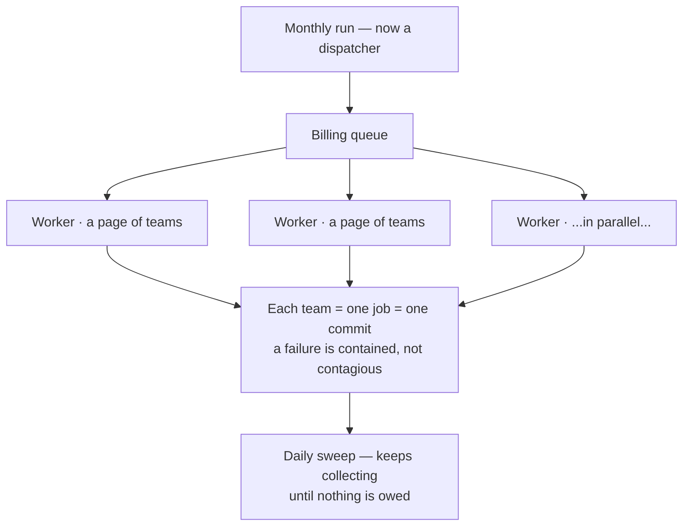
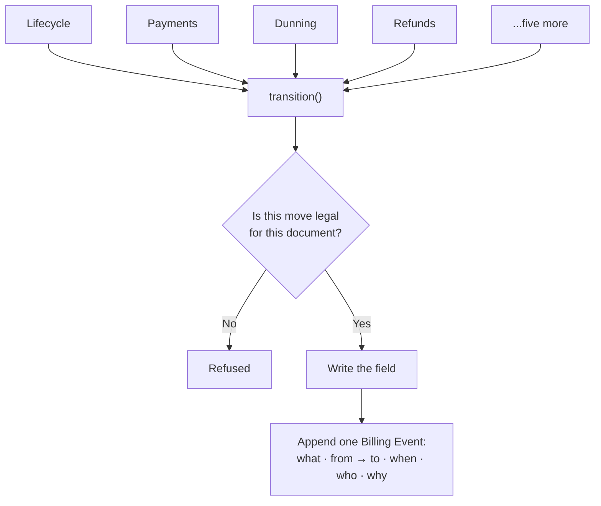

# Billing, under the hood

None of what follows was caused by an incident.

No customer complained, nothing broke in production, and as far as we can tell no money
was ever lost. We went looking anyway, because billing bugs have an unpleasant quality:
by the time a customer tells you about one, the money has already moved. A feature that
ships broken can be fixed on Monday. A payment taken twice is an apology, a refund, and a
customer who from then on reads every invoice twice.

So over a few weeks we tried to break our own billing on paper — not to see what *had*
gone wrong, but to find the places where it eventually would. We came back with a list.
This is what was on it and what we did about it.

Three words appear throughout. An **invoice** is a customer's bill for the month. A
**gateway** is the payment company — Stripe, Razorpay, PayPal — that actually moves the
money. A **webhook** is the message the gateway sends back to say the payment went
through.

---

## The dangerous moment

Every charge has a window in it where we are blind. We have asked the gateway to take the
money; we have not yet heard whether it did. It is usually a second or two. In that second
the network can drop, a worker can be killed by a deploy, the process can run out of
memory.

Our code handled that window badly, and the details matter.

The charge ran inside a database transaction. We wrote a Payment Attempt row, called the
gateway, then updated the row with the outcome — and none of it was committed until the
whole job finished. So if the worker died between the charge and the commit, the database
rolled back and **the Payment Attempt row ceased to exist**. The gateway had still taken
the money.

It got worse because of how we generated the key that stops double charges. A gateway will
refuse to charge the same request twice if you hand it the same idempotency key — but ours
was the attempt row's own random ID. When the row rolled back, the key died with it. The
retry the next day minted a fresh random key, the gateway had nothing to match it against,
and it charged the card again. The webhook for the first charge arrived pointing at a row
that no longer existed, and was dropped.

The customer is charged twice. The invoice is settled once. One payment sits stranded with
no record on our side.

And we could not have detected it. Our reconciliation job finds charged-but-never-confirmed
payments by walking the Payment Attempt rows that exist. A row that rolled back is invisible
to it. Our own safety net had a hole in exactly the shape of the failure. We would have
learned about it from an email.

### What we changed

We moved the gateway call *out* of the transaction, so it now sits between two of them.

First we write down what we are about to do and commit it. That record carries a key
derived from two facts that cannot change — which invoice, and which attempt number. Same
invoice, same attempt number, same key, always. It is never random, and that is the entire
point. Only then do we call the gateway.

Now the crash case has an answer. The Initiated row survived, because we committed it
before the money moved, so after any restart we can see exactly which charge was in flight
and what key it carried. A retry reuses that same key, and the gateway replays its first
answer instead of charging again. If nobody retries, the daily reconciliation sweep finds
the stuck attempt and asks the gateway directly what became of it.

The same key does two jobs, which is the part we like. Replaying an attempt we are unsure
about is safe, because the key is unchanged. But a genuinely new attempt — tomorrow's
scheduled retry after a real decline — gets the next attempt number, so a new key, so a
real new charge. One mechanism separates "ask again about the same charge" from "make a
different one", with nothing ambiguous in between.

One smaller decision came out of this. We release the lock on the invoice at the moment we
commit the claim, before the slow gateway call, so an incoming confirmation never has to
queue behind a charge that is still in progress.

We also stopped treating our own call returning as proof of anything. An invoice is marked
Paid when the gateway's confirmation arrives, or when reconciliation establishes it. An
uncertain charge is never allowed to look like a successful one.

This is written up as ADR 0017.

---

## One long line

The monthly run did everything in a single job, in order. One worker drafted every team's
invoice, then opened and collected every one of them, one after another — including the
slow round trip to the gateway on each.

At roughly two seconds per collected invoice, fifty thousand teams is more than a day of
continuous work in one process. And it is worse than slow, because one team hitting a
problem holds up everyone behind it. A monthly run that quietly half-finishes is not
discovered by us. It is discovered by the customers who were in the second half.

We rebuilt it while it was still comfortably fast, which felt premature at the time and is
the only sensible moment to do it.

The run became a dispatcher that hands out pages of teams to a pool of workers on their
own queue. Each team is its own job and its own commit, so a team that fails is recorded
and set aside while the rest carry on. Drafting and collecting became two separate ticks
instead of one, so preparing bills no longer moves at the speed of the slowest gateway
call.

We also stopped keeping a counter of progress in memory. A counter starts lying the moment
a worker dies; the tables do not. The run reads its own progress from the data, so a
half-finished run is visible and simply resumes — and resuming is free of double-billing
risk because of the idempotency work above.

Two mistakes we made along the way are worth recording.

The first: we had the collection tick fire once, five hours after drafting. That is fine
today and quietly wrong at scale, because the draft jobs may still be running at that
point. The scan would collect whatever happened to exist at that instant and orphan the
rest — and nothing would come back for them, because the tick came round once a month
pinned to a single period. Collection is now a daily sweep of every draft whose month has
closed. Drafts that land after one sweep are caught by the next. It is safe to re-run
precisely because each collection is idempotent, and once the run drains, the sweep is a
cheap indexed no-op.

The second: our first instinct was one background job per team. It is the obvious design
and it does not survive contact with a million teams — a million queued messages that
neither finish in time nor fit in memory. Pages of teams, a few thousand jobs each walking
its own slice, works.

A team that loses a lock race is now retried rather than dropped until next month. And a
database error during the team scan no longer reads as "a run with nothing to bill", which
is a failure mode that would have been silent and expensive.

On paper the run comes down from over a day to somewhere near an hour and a half at fifty
thousand teams with twenty workers. We have not run it at that size yet. What we can say
is that the shape is right and the failure of any one team is contained.

---

## We failed to ask, so they aren't late

One change in this area was not about correctness at all.

Our dunning ladder — the retries, the overdue notice, the eventual suspension — counted
from the invoice's due date. Which is fine, until the reason we did not collect on time is
*us*: the gateway rate-limited us, the run backed up, a worker died mid-charge. The
customer did nothing wrong, and starting their retry ladder and their suspension countdown
on that date would be charging them for our outage.

So invoices now carry a separate dunning clock. When a collection attempt fails on our
side, that clock moves forward and the customer gets their full grace period from the
point we actually managed to ask. It only ever moves forward, and a successful attempt
stops pushing it, so a permanently broken gateway cannot defer collection indefinitely —
it defers *escalation*, while reconciliation and the next run keep trying.

The due date itself is untouched. What a customer owed and when they owed it is an
accounting fact, and the aging report has to keep telling the truth.

---

## Hundreds of small questions

Spreading work across many workers only helps if building one invoice is cheap. Ours was
not.

To assemble a single bill, the code asked the database a question for every service the
team runs, another for every usage record, and then re-read the team's entire account once
for every region they operate in. It is the storeroom problem: walking back for one item
at a time instead of writing a list. Invisible at two hundred teams. A real drag at two
hundred thousand, and a direct tax on the fan-out we had just built.

We replaced the small trips with a few batched ones. A team's subscriptions, their changes,
their usage rollups and their prices are each fetched in one query, metered pricing is
resolved once per resource type rather than once per usage row, and the team is read once
for the whole invoice instead of once per region. The cost is now flat — a handful of
queries whether a team runs three services or three hundred.

Alongside that we added the indexes the hot money tables never had. The one that mattered
most: looking up a payment attempt by its gateway transaction ID had no index, which meant
every webhook settlement and every reconciliation sweep was a full table scan. That is a
latency problem today and a correctness problem the day the scan gets slow enough to matter.

Rewriting how money is computed is exactly the change that introduces a discrepancy nobody
notices for two months — a line dropped here, a charge attributed to the wrong region
there. So we did not take it on trust. There is a test that builds a real multi-region bill
the old way and the new way and asserts they produce the same lines, for both clusters.
The speed-up does not move a single paisa, and we can show it.

---

## Everyone had a key

The last one is the largest, and it is the one we are least finished with.

Billing has six state machines — an invoice's status, a payment attempt's, a payment
method's, a refund's, a webhook event's, and a subscription's account standing — and until
recently nothing owned any of them. Roughly nine different modules assigned a status
directly onto a document.

Invoice status alone was written from two places that did not know about each other: the
payments code set it to Paid when a webhook settled, and the billing run set Open, Paid and
Cancelled during the monthly cycle. Nothing prevented paying a cancelled invoice. Nothing
prevented reopening a paid one. There was no table anywhere saying which moves were legal.

The symptom was already visible if you knew where to look. One of our admin reports carried
a private constant ranking account standings, because there was nowhere to import that
ordering from. That is what an unowned state model looks like from the outside — small
duplications that seem harmless individually.

The other half of the problem: nothing recorded what happened, in order. Answering "why
wasn't this customer charged?" meant joining six tables by timestamp, by hand, and hoping
their status fields agreed.

Every status change now goes through one function. It knows the legal moves for each of
the six machines, refuses the illegal ones, writes the field, and appends one immutable row
to a Billing Event stream — what changed, from what to what, when, who, and why.

That stream is deliberately one-way. It is the read model for humans and reports, and the
billing logic is forbidden from reading it, so it can never quietly become a second source
of truth that disagrees with the first.

Two details were less obvious than they look.

Repeating a transition is treated as already done, not as an error. A duplicate webhook, a
reconciliation replay, and dunning re-applying the same standing all describe the same
outcome. In a world where webhooks arrive more than once, raising an alarm on that would be
wrong.

And the event log records the *name* of the document it describes rather than a link to it.
A link was already blocking us from deleting a payment method, and would have blocked
pruning old webhook records. An audit trail has to outlive the things it audits.

Finally, a test walks the billing code and fails the build on any status assignment that
bypasses the authority. We did this because a rule that lives only in code review is a rule
that erodes over a year of ordinary changes — the same reason we have a guard keeping
public endpoints out of the domain layer. Routing the last holdout took a while; the
boundary is now clean with no exceptions.

This is ADR 0016. It has landed on a branch and is not yet merged.

---

## What we haven't done

Being honest about the remaining list is most of the value of having made one.

The transition work has two pieces left. An invoice's amounts can still be edited after it
is finished, and they shouldn't be — the field-level lock is not written yet. And our
retention split (gateway logs for ninety days, invoices and the ledger forever, ERPNext as
the statutory record) is how the system already behaves, but exists nowhere as a written
decision.

Money arithmetic is still floating-point in places it shouldn't be. We know the fix — one
module doing decimal arithmetic with a single rounding policy, applied at line level — and
we haven't written it.

The durable-intent pattern is applied to card charges. It is not yet applied to payment
orders, top-up captures, or the provisioning call to the cluster manager, all of which
still hand-roll their own commit and rollback for the same underlying reason.

The daily sweeps run, but they don't page anyone. An invariant violation, a webhook stuck
in Failed for an hour, an attempt sitting past its reconciliation window — all of these are
detected and none of them wake anybody up.

And the throughput numbers in this document are arithmetic, not measurements. We have not
yet run a fifty-thousand-team month.

---

## What we took from it

Three things, mostly about when to do this kind of work rather than how.

**The right time to fix a scaling design is while it is still comfortably fast.** Every one
of these changes was easy to make this month and would have been an incident to make later.
None of them were urgent. That is the only reason they went well.

**A property that isn't enforced by a machine is a property you are slowly losing.** The
single-owner rule for status has a build-breaking guard. The uncertain-charge rule has a
daily reconciliation sweep. The rewritten rating path has an equivalence test. Not because
we distrust each other, but because none of us will remember this in eighteen months.

**Write down the reasoning, not the conclusion.** The decisions here are recorded as ADRs —
0016 for the transition authority, 0017 for durable intent — and the thing worth keeping in
them is the failure each one was designed against. A future engineer can always read the
code to learn what it does. What they cannot recover is what we were afraid of.

None of this adds anything a customer can see, and that is the point. The best outcome for
every change described here is that nobody ever has a reason to notice it.
