# Billing, under the hood

We spent a few weeks trying to break our own billing on paper. Nothing had gone wrong —
that was the point. Billing bugs are discovered by customers, and by then the money has
already moved.

We came back with a list of ten things. Nine are done. This is what they were.

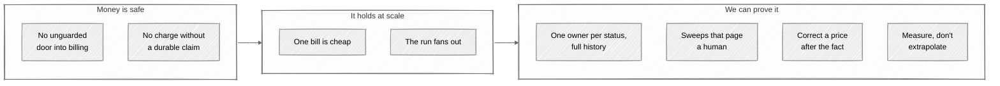

An **invoice** is a customer's bill for the month. A **gateway** is Stripe, Razorpay or
PayPal — whoever actually moves the money. A **webhook** is the gateway telling us the
payment went through.

---

## Ten unlocked doors

The first finding had nothing to do with money moving incorrectly. It was that quite a lot
of it could be moved by anyone who asked.

`@frappe.whitelist()` authenticates. It does not authorize. We had it on the billing
service primitives — mint credits, charge a card, delete a payment method, author a plan —
and the guarded dashboard wrappers around them checked the caller's team properly. But the
primitives carried the decorator themselves, so they were reachable directly, going around
the wrapper that did the checking.

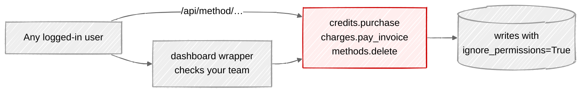

The permission layer that should have caught it was disabled by design: every primitive
writes with `ignore_permissions=True`, which is right for internal code and disastrous for
something exposed over HTTP. Ten findings, one root cause.

The fix was cheap because no internal caller depended on the decorator — each primitive was
called as a plain Python function by its wrapper, a sibling module, or a test. The
decorator came off, and the rule became: only `billing/api/**` may be whitelisted.

Two needed more. Top-up confirmation is legitimately reachable, and on the Razorpay path it
credited the amount the *client* sent rather than the amount the gateway captured. And
eleven places switched the session to Administrator without switching back, so later
permission-sensitive code in the same request ran as an admin.

A test now fails the build if `@frappe.whitelist` appears outside the API layer. We wrote
the guard before the fixes, which found two we had missed.

---

## The dangerous moment

Every charge has a window where we are blind: we have asked the gateway for the money and
have not heard back. A second or two, in which a worker can be killed by a deploy.

The charge ran *inside* a database transaction. So if the worker died before the commit,
the Payment Attempt row ceased to exist — while the gateway had still taken the money.

Worse, the idempotency key that stops double charges was the attempt row's own random ID.
Roll back the row, lose the key.

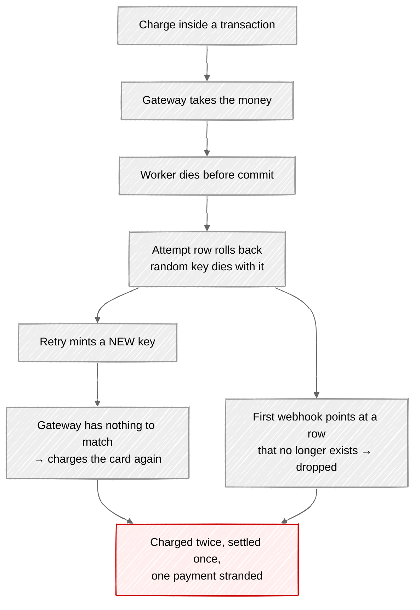

And it was undetectable: reconciliation finds stranded charges by walking the attempt rows
that exist. A rolled-back row is invisible to it. Our safety net had a hole in exactly the
shape of the failure.

The gateway call moved *out* of the transaction, and now sits between two of them.

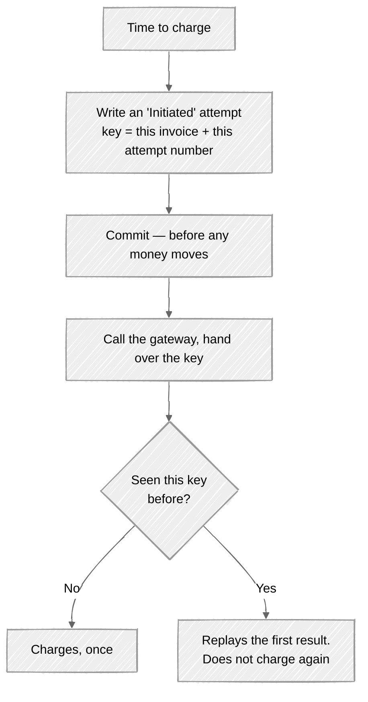

The key is derived from two facts that cannot change — which invoice, which attempt number.
Never random, which is the whole point. After a crash the Initiated row survives, so we know
what was in flight; a retry reuses the same key and the gateway replays its first answer.

The same key does two jobs. Replaying an uncertain attempt is safe because the key is
unchanged. A genuinely new attempt — tomorrow's retry after a real decline — gets the next
attempt number, a new key, a real new charge. No ambiguity in between.

We also stopped treating our own call returning as proof. Paid means the gateway said so,
or reconciliation established it. (ADR 0017.)

---

## One long line

The monthly run did everything in one job, in order: draft every team, then collect every
invoice, including the slow gateway round trip on each. At ~2s per collected invoice, fifty
thousand teams is over a day in a single process — and one bad team blocks everyone behind
it.

We rebuilt it while it was still comfortably fast, which is the only sensible time to.

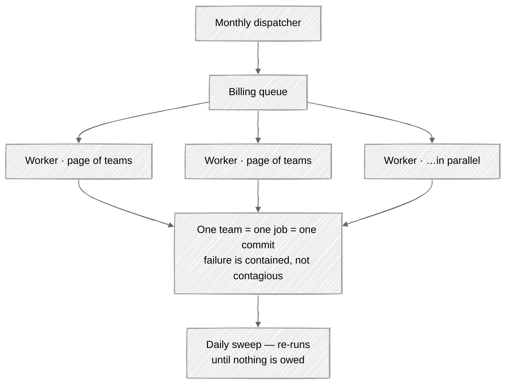

Progress is read from the tables, not a counter in memory: a counter starts lying the
moment a worker dies. So a half-finished run is visible and simply resumes — safely,
because of the idempotency work above.

Two mistakes worth recording:

**Collecting once, a few hours after drafting.** Fine today, wrong at scale — the draft
jobs may still be running, so the scan collects what happens to exist and orphans the rest,
with no later pass to catch them. It's a daily sweep now.

**One job per team.** The obvious design, and it dies at a million teams: a million queued
messages that neither finish in time nor fit in memory. Pages of teams work.

---

## We failed to ask, so they aren't late

One change here wasn't about correctness.

The dunning ladder — retries, overdue notice, suspension — counted from the due date. Fine,
until the reason we didn't collect is *us*: the gateway rate-limited us, the run backed up,
a worker died mid-charge.

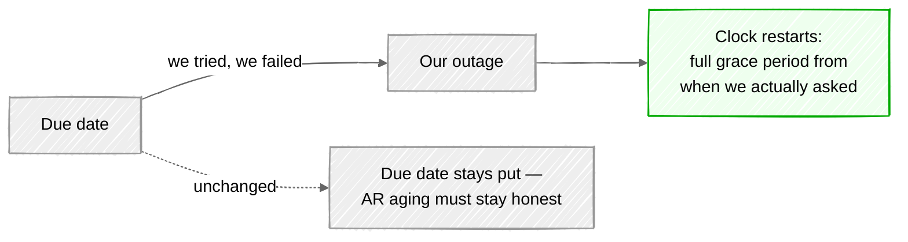

The clock only moves forward, and a successful attempt stops pushing it, so a permanently
broken gateway defers *escalation*, not collection. The due date is untouched: what a
customer owed and when is an accounting fact.

---

## Hundreds of small questions

Fanning work out only helps if one bill is cheap. Ours wasn't.

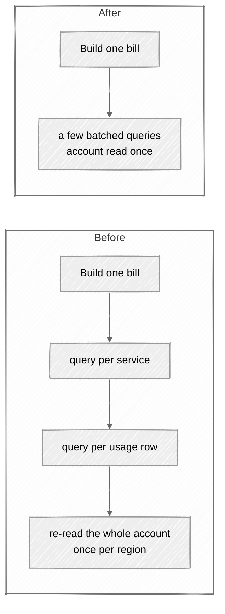

Metered pricing is resolved once per resource type instead of once per usage row. And we
added the indexes the hot money tables never had — looking up a payment attempt by gateway
transaction ID had none, so **every webhook settlement and every reconciliation sweep was a
full table scan**.

Rewriting how money is computed is exactly the change that introduces a quiet discrepancy.
So there's a test that builds a real multi-region bill the old way and the new way and
asserts identical lines. The speed-up doesn't move a paisa, and we can show it.

---

## Everyone had a key

Seven status fields — invoice, payment attempt, payment method, refund, webhook event,
account standing, commitment — and nothing owned any of them. Nine modules wrote statuses
directly.

Invoice status alone was set from two places that didn't know about each other. Nothing
prevented paying a cancelled invoice or reopening a paid one. And nothing recorded what
happened in order, so "why wasn't this customer charged?" meant joining six tables by
timestamp and hoping they agreed.

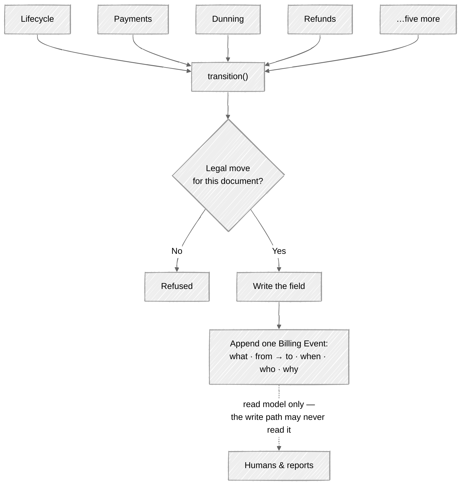

The stream is one-way on purpose: drop the table and not one invoice total changes, so it
can never become a second source of truth that disagrees with the first.

Two subtleties. A repeated transition is *already done*, not an error — a duplicate
webhook, a reconciliation replay and dunning re-applying a standing all describe the same
outcome. And the log stores the document's *name*, not a link: a link was already blocking
deletion of a payment method. An audit trail has to outlive what it audits.

A test fails the build on any status write that bypasses the authority. The exception list
is empty. (ADR 0016.)

---

## The sweeps that told nobody

We had three standing controls — reconciliation, the invariant audit, webhook failure
recording. All three worked. None told a human anything; they wrote to a log somebody
would have to think to go and read.

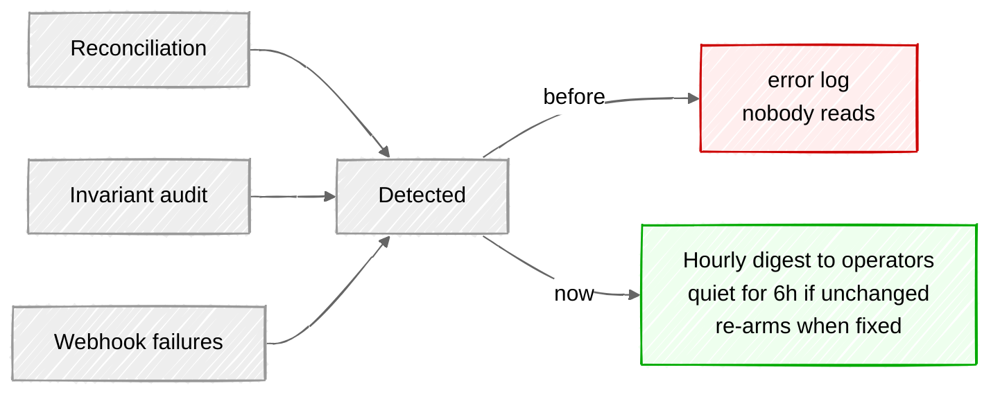

Each run phase now emits its counters — drafted, skipped, failed, settled, duration — as
one parseable line, and each period gets a durable Billing Run row. That row is re-derived
from the tables on every refresh rather than accumulated, for the same reason the run reads
its own progress from the data.

The pager covers three things the sweeps can detect but not fix: an invariant that no
longer holds, a webhook failed over an hour, an attempt still in flight a day after
reconciliation should have answered it. A digest, not one mail per row — alert fatigue is
how real alerts get ignored.

Four new views on data we already had: webhook lag, dunning recovery, involuntary churn,
and gateway auth rate as a trend rather than a number. The last three read off the Billing
Event stream — its first real use as a read model — so they only see transitions since the
stream began. Better an honest horizon than a guessed history.

---

## When the price was wrong

Sooner or later a rate is wrong and the month is already billed. Our answer was editing
rows by hand, which is the answer that ends up in a post-mortem.

Each usage rollup carries the rate and allowance locked when it was first received — that
grandfathering is what makes a metered charge auditable months later. Editing it in place
destroys the property it exists for. So a correction writes a new version:

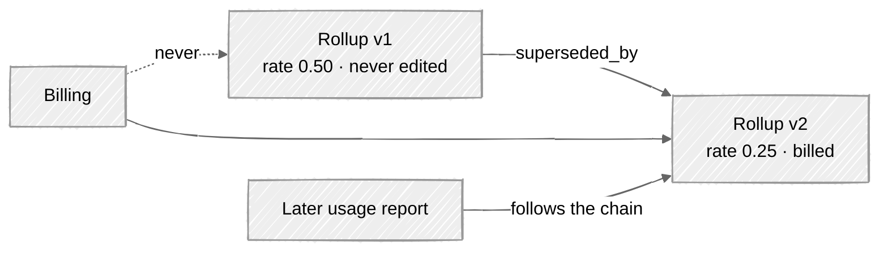

Re-issuing works the same way — nothing is edited, everything is recorded:

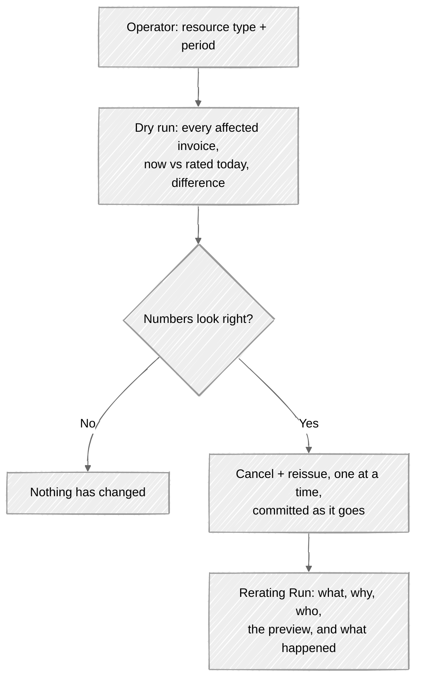

Paid invoices are excluded. Money already taken is a refund's problem, and rewriting a bill
somebody has paid isn't a correction.

---

## Measuring instead of guessing

Every throughput number we'd quoted was arithmetic: 2s per invoice × 50k teams ÷ 20
workers. Reasonable, and not the same as knowing.

So we built a seeded run — N teams, real subscriptions — that asserts three things: it
stayed inside a per-team time budget, no money invariant broke, and a run killed half way
through and restarted produces exactly one invoice per team. N is an environment variable,
so the same test is a fast guard by default and a load run before a release.

At a thousand teams: **~14ms per team to draft**, single process. Against the 2 seconds we'd
been assuming for that half.

The budget is set far above the measurement on purpose. It isn't a benchmark — it's there
to catch someone reintroducing a per-team query.

We have not run it at fifty thousand teams. We now have the tool to.

---

## What we haven't done

**The suite is not green, and this work didn't make it green.** 28 failures and 5 errors of
943 tests — exactly where it stood before. Most are fixture pollution between test classes:
metered plan fixtures cleaned up by one test, missing for the next, so the failure travels
with the ordering. Fixable, and a day's work of its own. Until then "green" can't be a merge
gate and we should stop pretending it is.

**One red is a real bug we left red.** A disabled subscription — paused, or on a terminated
machine — still counts toward the team's run rate, so it still consumes the headroom that
decides whether they can launch anything new. The obvious fix breaks something real:
subscriptions are created disabled and only enabled once the machine is running, so
filtering them out lets a team provisioning several at once sail past their spend cap.
That's a product decision about whether a pending machine consumes headroom, and we'd
rather leave the question open than paper over it.

**Money arithmetic is still floating point.** One module, decimal, one rounding policy at
line level, plus an assertion that subtotal equals the sum of lines. Designed, unwritten,
and the largest correctness item outstanding.

**Durable intent covers card charges only.** Payment orders, top-up captures and the
provisioning call still hand-roll commit and rollback for the same underlying reason. The
pattern is proven; it hasn't been carried across.

**A finished invoice's amounts can still be edited.** The field lock that would make
cancel-and-reissue the only correction path is designed and unwritten — as is our retention
policy, which the system already follows but nobody has written down.

---

## What we took from it

**Fix a scaling design while it's still comfortably fast.** Every change here was easy this
month and would have been an incident later. None were urgent. That's why they went well.

**A property no machine enforces is one you're slowly losing.** Two build-breaking guards,
two daily sweeps, an hourly page, an equivalence test. Not distrust — none of us will
remember any of this in eighteen months.

**Write down the reasoning, not the conclusion.** The code says what it does. What it can't
tell you is what we were afraid of.

None of this adds anything a customer can see. That's the point.
