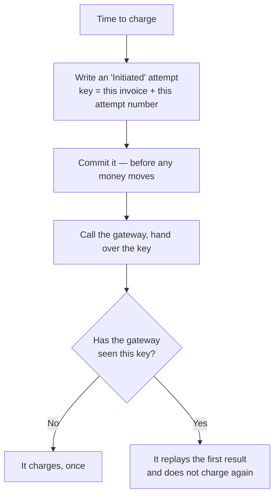
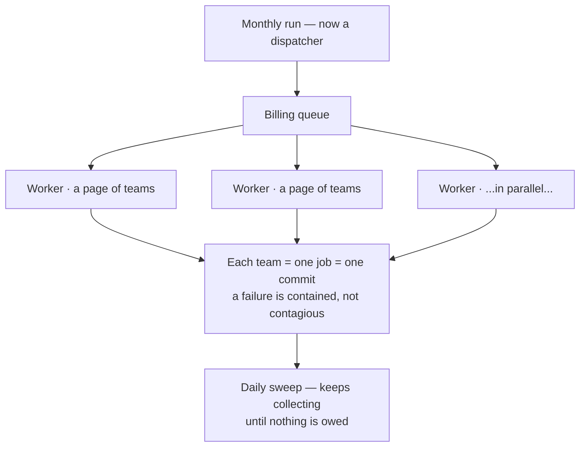
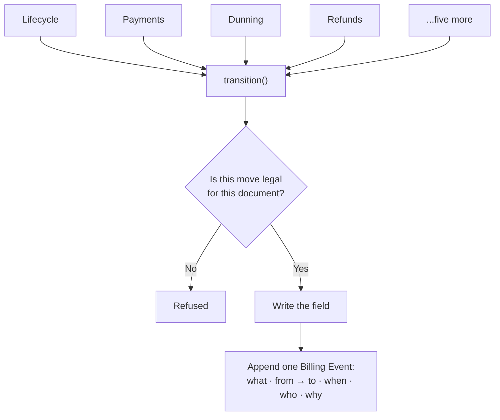

# Billing, under the hood

None of what follows was caused by an incident.

No customer complained, nothing broke in production, and as far as we can tell no money
was ever lost. We went looking anyway, because billing bugs have an unpleasant quality:
by the time a customer tells you about one, the money has already moved. A feature that
ships broken can be fixed on Monday. A payment taken twice is an apology, a refund, and a
customer who from then on reads every invoice twice.

So over a few weeks we tried to break our own billing on paper — not to see what *had*
gone wrong, but to find the places where it eventually would. We came back with a list of
ten things. This is what was on it, what we did, and what is still open.

Three words appear throughout. An **invoice** is a customer's bill for the month. A
**gateway** is the payment company — Stripe, Razorpay, PayPal — that actually moves the
money. A **webhook** is the message the gateway sends back to say the payment went
through.

---

## Ten unlocked doors

The first thing we found had nothing to do with money moving incorrectly. It was that
quite a lot of it could be moved by anyone who asked.

Frappe has a decorator, `@frappe.whitelist()`, that makes a Python function callable over
HTTP. We had put it on our billing service functions — the ones that mint credits, charge
a card, delete a payment method, author a catalog plan. The dashboard called those
functions through wrappers that checked, properly, whether you were allowed to act on the
team in question.

The trouble is that the decorator is authentication, not authorization. It asks whether
you are logged in. It does not ask whether this is your team. And because the primitives
carried the decorator themselves, they were independently reachable at
`/api/method/...` — going around the wrapper that did the checking. Any logged-in user
could mint credit balance for any team.

There was a second layer that should have caught this. Billing doctypes are
System-Manager-only, so ordinary permissions would have refused. Except every one of
those functions writes with `ignore_permissions=True`, which is correct for a service
function called internally and disastrous for one exposed to the internet.

Ten findings, and one root cause underneath all of them.

The fix was cheaper than it looked. We traced every flagged function and found that no
internal caller depended on the decorator — each was called as a plain Python function by
its own wrapper, by a sibling module, or by a test. So the decorator came off, and the
rule became: only code under `billing/api/**` may be whitelisted. Everything else is a
domain primitive and is not reachable over HTTP at all.

Two of the ten needed more than that. The top-up confirmation endpoint is *legitimately*
reachable, and on its Razorpay path it credited the amount the client sent rather than the
amount the gateway said it captured. That one is a real second bug and got a real fix:
ask the gateway. And eleven places switched the session to Administrator without switching
it back, so anything permission-sensitive later in the same request quietly ran as an
administrator.

A test now walks the codebase and fails the build if `@frappe.whitelist` appears outside
the API layer. We wrote the guard before we wrote the fixes, which turned out to be the
right order — it found two we had missed.

---

## The dangerous moment

Every charge has a window in it where we are blind. We have asked the gateway to take the
money; we have not yet heard whether it did. It is usually a second or two. In that second
the network can drop, a worker can be killed by a deploy, the process can run out of
memory.

Our code handled that window badly, and the details matter.

The charge ran inside a database transaction. We wrote a Payment Attempt row, called the
gateway, then updated the row with the outcome — and none of it was committed until the
whole job finished. So if the worker died between the charge and the commit, the database
rolled back and **the Payment Attempt row ceased to exist**. The gateway had still taken
the money.

It got worse because of how we generated the key that stops double charges. A gateway will
refuse to charge the same request twice if you hand it the same idempotency key — but ours
was the attempt row's own random ID. When the row rolled back, the key died with it. The
retry the next day minted a fresh random key, the gateway had nothing to match it against,
and it charged the card again. The webhook for the first charge arrived pointing at a row
that no longer existed, and was dropped.

The customer is charged twice. The invoice is settled once. One payment sits stranded with
no record on our side.

And we could not have detected it. Our reconciliation job finds charged-but-never-confirmed
payments by walking the Payment Attempt rows that exist. A row that rolled back is invisible
to it. Our own safety net had a hole in exactly the shape of the failure. We would have
learned about it from an email.

### What we changed

We moved the gateway call *out* of the transaction, so it now sits between two of them.

First we write down what we are about to do and commit it. That record carries a key
derived from two facts that cannot change — which invoice, and which attempt number. Same
invoice, same attempt number, same key, always. It is never random, and that is the entire
point. Only then do we call the gateway.

Now the crash case has an answer. The Initiated row survived, because we committed it
before the money moved, so after any restart we can see exactly which charge was in flight
and what key it carried. A retry reuses that same key, and the gateway replays its first
answer instead of charging again. If nobody retries, the daily reconciliation sweep finds
the stuck attempt and asks the gateway directly what became of it.

The same key does two jobs, which is the part we like. Replaying an attempt we are unsure
about is safe, because the key is unchanged. But a genuinely new attempt — tomorrow's
scheduled retry after a real decline — gets the next attempt number, so a new key, so a
real new charge. One mechanism separates "ask again about the same charge" from "make a
different one", with nothing ambiguous in between.

We also stopped treating our own call returning as proof of anything. An invoice is marked
Paid when the gateway's confirmation arrives, or when reconciliation establishes it. An
uncertain charge is never allowed to look like a successful one.

This one is written up as ADR 0017. It is the decision the rest of the work leans on
hardest.

---

## One long line

The monthly run did everything in a single job, in order. One worker drafted every team's
invoice, then opened and collected every one of them, one after another — including the
slow round trip to the gateway on each.

At roughly two seconds per collected invoice, fifty thousand teams is more than a day of
continuous work in one process. And it is worse than slow, because one team hitting a
problem holds up everyone behind it. A monthly run that quietly half-finishes is not
discovered by us. It is discovered by the customers who were in the second half.

We rebuilt it while it was still comfortably fast, which felt premature at the time and is
the only sensible moment to do it.

The run became a dispatcher that hands out pages of teams to a pool of workers on their
own queue. Each team is its own job and its own commit, so a team that fails is recorded
and set aside while the rest carry on. Drafting and collecting became two separate ticks
instead of one, so preparing bills no longer moves at the speed of the slowest gateway
call.

We also stopped keeping a counter of progress in memory. A counter starts lying the moment
a worker dies; the tables do not. The run reads its own progress from the data, so a
half-finished run is visible and simply resumes — and resuming is free of double-billing
risk because of the idempotency work above.

Two mistakes we made along the way are worth recording.

The first: we had the collection tick fire once, five hours after drafting. That is fine
today and quietly wrong at scale, because the draft jobs may still be running at that
point. The scan would collect whatever happened to exist at that instant and orphan the
rest — and nothing would come back for them, because the tick came round once a month
pinned to a single period. Collection is now a daily sweep of every draft whose month has
closed. Drafts that land after one sweep are caught by the next. It is safe to re-run
precisely because each collection is idempotent, and once the run drains, the sweep is a
cheap indexed no-op.

The second: our first instinct was one background job per team. It is the obvious design
and it does not survive contact with a million teams — a million queued messages that
neither finish in time nor fit in memory. Pages of teams, a few thousand jobs each walking
its own slice, works.

A team that loses a lock race is now retried rather than dropped until next month. And a
database error during the team scan no longer reads as "a run with nothing to bill", which
is a failure mode that would have been silent and expensive.

---

## We failed to ask, so they aren't late

One change in this area was not about correctness at all.

Our dunning ladder — the retries, the overdue notice, the eventual suspension — counted
from the invoice's due date. Which is fine, until the reason we did not collect on time is
*us*: the gateway rate-limited us, the run backed up, a worker died mid-charge. The
customer did nothing wrong, and starting their retry ladder and their suspension countdown
on that date would be charging them for our outage.

So invoices now carry a separate dunning clock. When a collection attempt fails on our
side, that clock moves forward and the customer gets their full grace period from the
point we actually managed to ask. It only ever moves forward, and a successful attempt
stops pushing it, so a permanently broken gateway cannot defer collection indefinitely —
it defers *escalation*, while reconciliation and the next run keep trying.

The due date itself is untouched. What a customer owed and when they owed it is an
accounting fact, and the aging report has to keep telling the truth.

---

## Hundreds of small questions

Spreading work across many workers only helps if building one invoice is cheap. Ours was
not.

To assemble a single bill, the code asked the database a question for every service the
team runs, another for every usage record, and then re-read the team's entire account once
for every region they operate in. It is the storeroom problem: walking back for one item
at a time instead of writing a list. Invisible at two hundred teams. A real drag at two
hundred thousand, and a direct tax on the fan-out we had just built.

We replaced the small trips with a few batched ones. A team's subscriptions, their changes,
their usage rollups and their prices are each fetched in one query, metered pricing is
resolved once per resource type rather than once per usage row, and the team is read once
for the whole invoice instead of once per region.

Alongside that we added the indexes the hot money tables never had. Looking up a payment
attempt by its gateway transaction ID had no index, which meant **every webhook settlement
and every reconciliation sweep was a full table scan**. Invoices had no index on team, and
usage rollups none on the team-and-period lookup the run does for everyone. We also dropped
a duplicate index on the credit ledger that was declared both unique and searchable —
paying twice to maintain the same thing.

Rewriting how money is computed is exactly the change that introduces a discrepancy nobody
notices for two months — a line dropped here, a charge attributed to the wrong region
there. So we did not take it on trust. There is a test that builds a real multi-region bill
the old way and the new way and asserts they produce the same lines, for both clusters.
The speed-up does not move a single paisa, and we can show it.

---

## Everyone had a key

Billing has seven status fields — an invoice's, a payment attempt's, a payment method's, a
refund's, a webhook event's, a subscription's account standing, and a commitment's — and
until recently nothing owned any of them. Roughly nine different modules assigned a status
directly onto a document.

Invoice status alone was written from two places that did not know about each other: the
payments code set it to Paid when a webhook settled, and the billing run set Open, Paid and
Cancelled during the monthly cycle. Nothing prevented paying a cancelled invoice. Nothing
prevented reopening a paid one. There was no table anywhere saying which moves were legal.

The symptom was already visible if you knew where to look. One of our admin reports carried
a private constant ranking account standings, because there was nowhere to import that
ordering from. That is what an unowned state model looks like from the outside — small
duplications that seem harmless individually.

The other half of the problem: nothing recorded what happened, in order. Answering "why
wasn't this customer charged?" meant joining six tables by timestamp, by hand, and hoping
their status fields agreed.

Every status change now goes through one function. It knows the legal moves for each
machine, refuses the illegal ones, writes the field, and appends one immutable row to a
Billing Event stream — what changed, from what to what, when, who, and why.

That stream is deliberately one-way. It is the read model for humans and reports, and the
billing logic is forbidden from reading it, so it can never quietly become a second source
of truth that disagrees with the first. Drop the table and not one invoice total changes.

Two details were less obvious than they look.

Repeating a transition is treated as already done, not as an error. A duplicate webhook, a
reconciliation replay, and dunning re-applying the same standing all describe the same
outcome. In a world where webhooks arrive more than once, raising an alarm on that would be
wrong.

And the event log records the *name* of the document it describes rather than a link to it.
A link was already blocking us from deleting a payment method, and would have blocked
pruning old webhook records. An audit trail has to outlive the things it audits.

Finally, a test walks the billing code and fails the build on any status assignment that
bypasses the authority — the same shape of guard as the whitelist one. We did this because
a rule that lives only in code review is a rule that erodes over a year of ordinary
changes. The allowlist of exceptions is empty.

This is ADR 0016.

---

## The sweeps that told nobody

By this point we had three standing controls: a daily reconciliation asking the gateway
about uncertain charges, a daily invariant audit checking the money adds up two different
ways, and a webhook processor recording its own failures.

All three worked. None of them told a human anything. They wrote to an error log that
somebody would have to think to go and read. A control nobody reads is a control you
have in principle.

So the run now says what it did, and someone gets told when it goes wrong.

Every phase of the monthly run emits its counters — drafted, skipped, failed, settled, and
how long the page took — as a single parseable line a log scraper can pick up. Each period
also gets a durable Billing Run row: how many teams, how many drafted, how many still
owed, how many failures. That row is refreshed from the tables every time rather than
accumulated, for the same reason the run reads its own progress from the data — a counter
starts lying the moment a worker dies, and the run you most need to read is the one that
only half happened.

An hourly job now pages the operators on three things the sweeps can detect but cannot
fix: an invariant that no longer holds, a webhook that failed to process and has sat there
for over an hour, and a payment attempt still in flight a day after reconciliation should
have answered it. It mails a digest rather than one message per row, and an unchanged
digest goes quiet for six hours — an unfixed problem should not mail you sixty times, and
alert fatigue is how real alerts get ignored. Fixing the problem re-arms it immediately.

We added four internal views on data we already had: webhook lag from receipt to
processing, dunning recovery — of the invoices that went overdue, how many we eventually
collected — involuntary churn, the teams we lost to non-payment rather than to choice, and
gateway authorisation rate as a trend rather than a single number, because a dip is only
legible against a line.

The last three of those read off the Billing Event stream, which is the first real use of
it as a read model. It also means they only see transitions since the stream started. We
would rather have a report that is honest about its horizon than one that guesses at
history.

---

## When the price was wrong

Sooner or later a rate is wrong and a month has already been billed on it. We had no
answer for that beyond editing rows by hand, which is the answer that ends up in a
post-mortem.

Two things were missing.

The first is a way to correct a metered usage record. Each usage rollup carries the rate
and allowance that were locked when it was first received — that grandfathering is what
makes a metered charge auditable months later. Editing those terms in place would destroy
the very property they exist for. So a correction now writes a *new version* of the row
with the corrected terms and points the old one at it. The old row is never touched, never
billed again, and still readable. Later usage reports for that period follow the chain and
land on the version that is actually live, so reporting keeps working across a correction.

The second is re-issuing. An operator names a resource type and a period, and gets back a
dry run: every affected invoice, what it says now, what it would say if it were rated
today, and the difference. Nothing has changed at that point. If the numbers look right,
applying it cancels and re-issues each invoice through the ordinary correction path — one
at a time, committed as it goes, so a failure half way through leaves the ones it already
fixed correct. The whole thing is recorded as a Rerating Run: what was corrected, why, who
asked, the preview, and what actually happened to each invoice.

Paid invoices are excluded. Money already taken is a refund's problem, not a re-issue's,
and quietly rewriting a bill somebody has already paid is not a correction.

---

## Measuring instead of guessing

Every throughput number we had been quoting was arithmetic. Two seconds per invoice times
fifty thousand teams, divided by twenty workers. Reasonable arithmetic, and not the same
thing as knowing.

So we built a seeded run. It creates N teams with real subscriptions, bills them, and
asserts three things: that it stayed inside a per-team time budget, that not one money
invariant broke, and that a run killed half way through and restarted produces exactly one
invoice per team and no duplicates. N is an environment variable, so the same test is a
fast guard by default and a real load run before a release.

Then we ran it at a thousand teams and measured: **about 14 milliseconds per team to
draft**, in a single process on a dev bench. That is a real number, and it is a lot better
than the two seconds we had been assuming for the drafting half.

The budget in the test is set far above the measurement on purpose. It is not a benchmark
of the machine — it exists to catch someone reintroducing a per-team query, which is a
regression that would otherwise show up as a slightly slower month nobody notices until it
is a very slow month.

We have not run it at fifty thousand teams. We now have the tool to.

---

## What we haven't done

Being honest about the remaining list is most of the value of having made one.

**The test suite is not green, and this work did not make it green.** It stands at 28
failures and 5 errors out of 943 tests — exactly where it stood before, since everything
here added tests that pass and broke nothing that passed. Most of the failures are fixture
pollution between test classes rather than product bugs: metered plan fixtures get cleaned
up by one test and are then missing for the next, so the failure travels with the ordering.
That is fixable and it is a day's work on its own, not a line item in someone else's
ticket. Until it is done, "the suite is green" cannot be a merge gate, and we should stop
pretending otherwise.

One of those failures is not pollution. A subscription that has been disabled — paused, or
belonging to a terminated machine — still counts toward the team's committed run rate, and
so still consumes the headroom that decides whether they may launch something new. We
tried the obvious fix, excluding disabled subscriptions, and it breaks something real:
subscriptions are created disabled and only enabled once the machine is running, so
filtering them out means a team provisioning several machines at once could sail past
their spend cap. Getting this right is a product decision about whether a pending machine
should consume headroom, and we would rather leave the test red and the question open than
paper over it.

**Money arithmetic is still floating point** where it should not be. We know the fix — one
module doing decimal arithmetic with a single rounding policy, applied at line level, with
an assertion that an invoice's subtotal equals the sum of its lines. We have not written
it, and it is the largest correctness item still outstanding.

**Durable intent is only applied to card charges.** Payment orders, top-up captures and the
provisioning call to the cluster manager still hand-roll their own commit and rollback for
exactly the same underlying reason. The pattern is proven now; it just has not been carried
across.

**An invoice's amounts can still be edited after it is finished.** The field-level lock
that would make cancel-and-reissue the only correction path is designed and unwritten. And
our retention split — gateway logs for ninety days, invoices and the ledger forever,
ERPNext as the statutory record — is how the system already behaves but exists nowhere as a
written decision.

---

## What we took from it

Three things, mostly about when to do this kind of work rather than how.

**The right time to fix a scaling design is while it is still comfortably fast.** Every one
of these changes was easy to make this month and would have been an incident to make later.
None of them were urgent. That is the only reason they went well.

**A property that isn't enforced by a machine is a property you are slowly losing.** Two
build-breaking guards, two daily sweeps, an hourly page, and an equivalence test on the
rewritten rating path. Not because we distrust each other, but because none of us will
remember any of this in eighteen months.

**Write down the reasoning, not the conclusion.** The load-bearing decisions are recorded
as ADRs, and the thing worth keeping in them is the failure each one was designed against.
A future engineer can always read the code to learn what it does. What they cannot recover
is what we were afraid of.

None of this adds anything a customer can see, and that is the point. The best outcome for
every change described here is that nobody ever has a reason to notice it.
