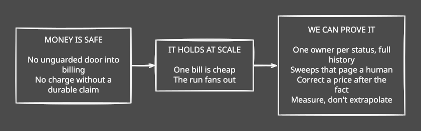
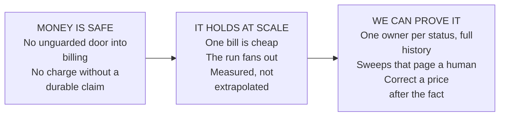

# Billing, under the hood

We spent a few weeks trying to break our own billing on paper. Nothing had gone wrong —
that was the point. Billing bugs are discovered by customers, and by then the money has
already moved.

We came back with a list of ten things. Nine are done. It runs to three parts:

1. **[Money is safe](billing-01-money-is-safe.md)** — ten unguarded doors into billing,
   and how a crash mid-charge could take the money twice.
2. **[It holds at scale](billing-02-it-holds-at-scale.md)** — the monthly run as one long
   queue, why a customer shouldn't pay for our outage, and making one bill cheap to build.
3. **[We can prove it](billing-03-we-can-prove-it.md)** — one owner per status, sweeps that
   page a human, correcting a price after the fact, and measuring instead of extrapolating.

diagram source

An **invoice** is a customer's bill for the month. A **gateway** is Stripe, Razorpay or
PayPal — whoever actually moves the money. A **webhook** is the gateway telling us the
payment went through.

---

## TL;DR

- **Closed ten unguarded doors.** Billing primitives were callable over HTTP with no
  authorization check — any logged-in user could mint credits for any team. A
  build-breaking test now keeps the domain layer off the network.
- **A crash can no longer double-charge.** The gateway call moved out of the database
  transaction, behind a durably committed claim whose idempotency key is derived from the
  invoice and attempt number — not a random id that died on rollback, taking the only
  defence against a second charge with it.
- **The monthly run fans out.** One team per job, one commit each, and a daily sweep that
  re-runs until nothing is owed. One stuck team no longer holds up the rest.
- **One bill is cheap to build.** Batched queries instead of one per service and one per
  usage row, plus the indexes the money tables never had — looking a payment attempt up by
  its gateway transaction id was a full table scan on every single webhook.
- **One owner per status.** Seven state machines behind a single `transition()`, every move
  appended to an immutable event stream, held in place by a second build-breaking guard.
- **The sweeps page a human.** They had been detecting problems for months and telling
  nobody.
- **A wrong price is fixable** without editing history: usage rollups are versioned rather
  than edited, and invoices are re-issued in bulk behind a dry run.
- **Customers don't pay for our outages.** When collection fails on our side, the dunning
  clock restarts, so our backlog never eats their grace period.
- **Measured, not extrapolated:** ~14ms per team to draft, at a thousand teams.

Still open: the test suite is not green (28 failures, unchanged by this work), money
arithmetic is still floating point, and durable intent covers card charges but not yet
top-ups or provisioning.

---

diagram source

An **invoice** is a customer's bill for the month. A **gateway** is Stripe, Razorpay or
PayPal — whoever actually moves the money. A **webhook** is the gateway telling us the
payment went through.
