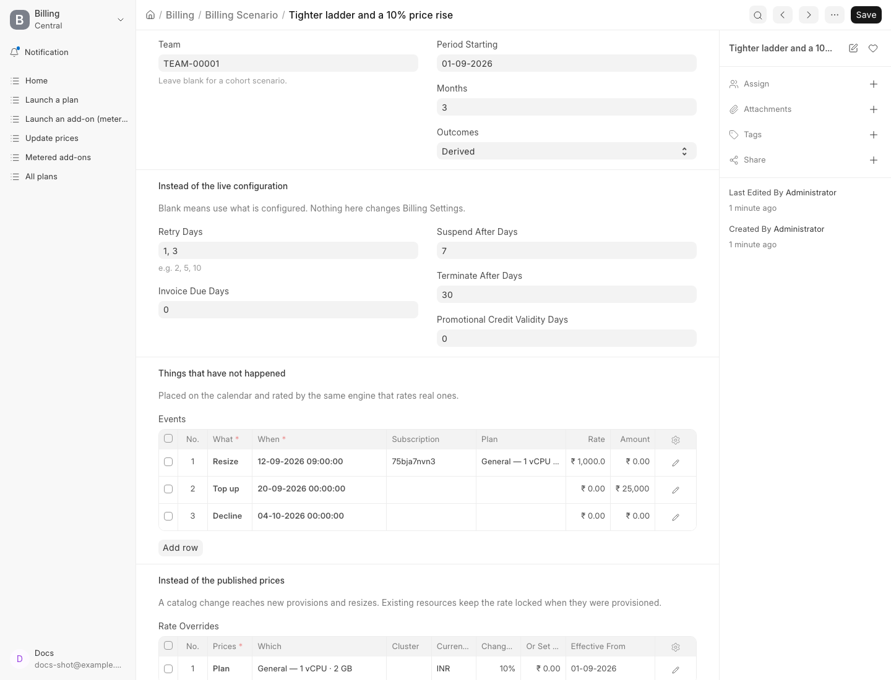
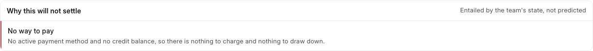
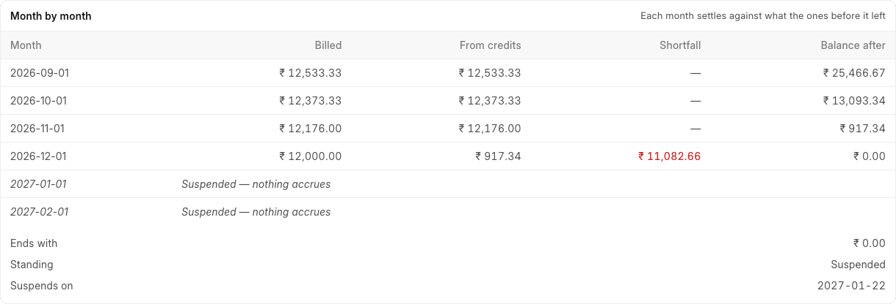
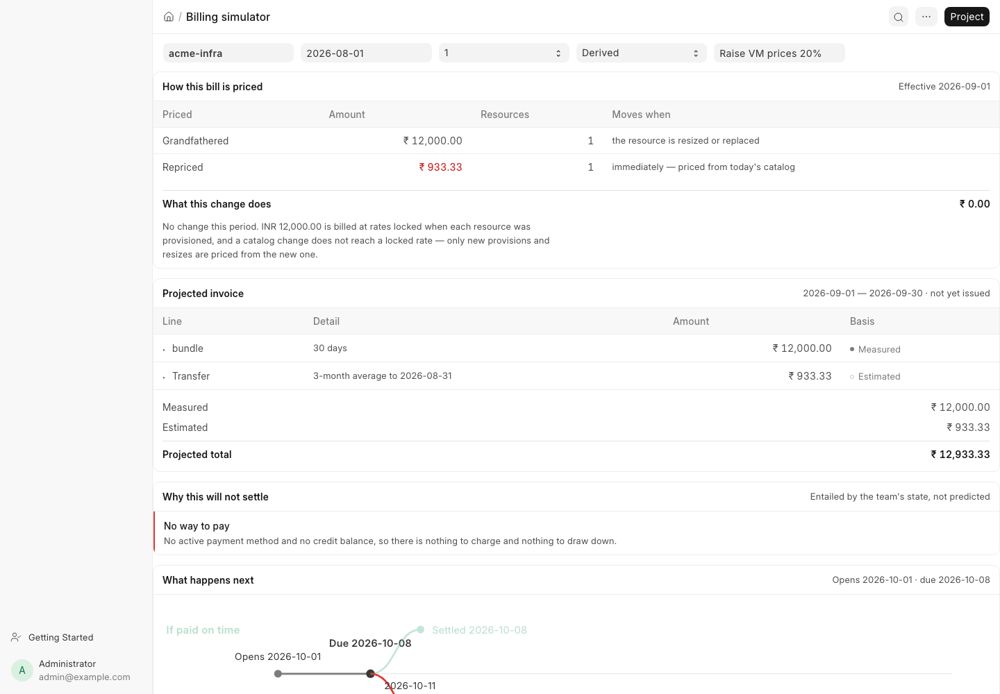
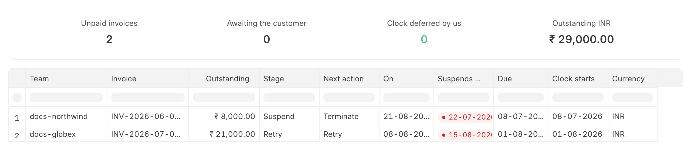
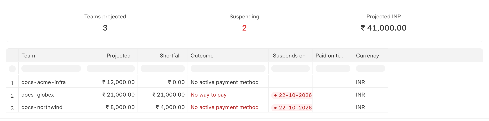
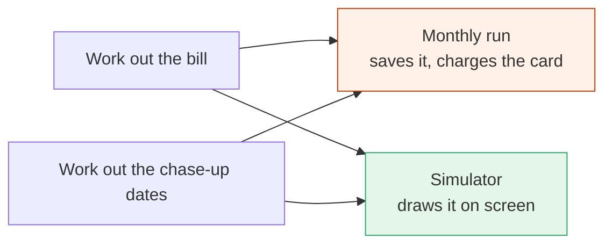
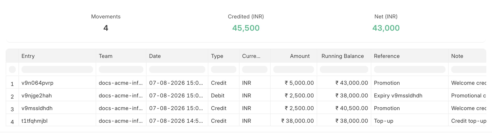
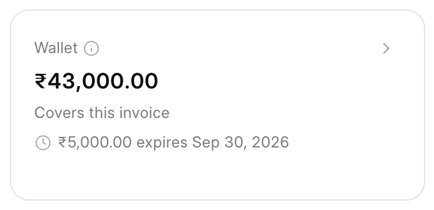

# Asking the billing system what it is going to do

Two updates this fortnight. A **billing simulator** for the ops and accounts team, and
**credits are now a setting** ([PR #234](https://github.com/frappe/central/pull/234)).
Most of this is about the simulator.

## The problem

Billing runs on the 1st. That is when we find out what it did.

This is a problem for the people who have to answer for it:

- **Support** gets "why is my bill this much?" and has no way to check except reading
  code or waiting for the invoice.
- **Accounts** wants to know how many customers will be short next month. There is no
  way to ask.
- **Anyone changing a billing setting** is changing it blind. Cut termination from 44
  days to 30 and some number of customers get cut off sooner. Nobody can say how many
  until it happens.

The rules themselves are fine. They are just only visible once a month, after the fact.

## What we built

A page where you pick a team and a month, and it tells you what billing will do to that
team. The bill, the date we charge, and what happens if they don't pay.

Then a second thing on top of it: you can change something first and ask again.

That second part is the point. A single team's future bill is useful for support. Being
able to change a rule and see who it hurts is what the ops team actually needs.

## The questions you can ask

Billing has rules that are correct, deliberate, and invisible until they surprise
someone. There is a shelf of saved questions, each one about a rule that has confused
somebody before. Pick a question, pick a real team, and watch it happen.

| Question | What it shows |
| --- | --- |
| What if we suspend a week sooner? | Every date on the unpaid branch moves. You see which teams cross the line. |
| What happens when an INR bill crosses ₹15,000? | It goes to "Action Required", not a failed charge. Nothing is auto-debited above that, by design. |
| A team with no card and no credits | What the page says before the 1st, and when they get suspended. |
| A prepaid team whose wallet runs out | Which month the shortfall starts. One month alone won't show it. |
| Does a mid-month top-up reach this month's bill? | Yes — and you can see it close the gap. |
| Why did one day bill by the hour? | Two resizes inside 24 hours. That day leaves daily billing and bills real hours. |
| What does a 20% price rise do to revenue? | Close to nothing. Explained below. |
| The billing run was three days late — does the customer lose their grace period? | No. |

That last one matters as much as the rest. Its correct answer is "nothing bad happens",
and being able to show that is worth more than saying it.

Adding a question to the shelf is a few lines of configuration. No code change.

## Changing a setting without changing it

Take the dunning example properly, because it is the case that made us build this.

Today we retry on set days, suspend after 14 days, terminate after 44. Suppose accounts
wants to terminate at 30 instead.

You write 30 into a **Billing Scenario** and run it. Billing Settings are not touched.
The simulator reads your number instead of the real one, for that one projection.

## Billing Scenario

This is the part the ops team owns. It is an ordinary Desk record — a saved question,
made without a developer.

That one asks: tighten the ladder to suspend at 7 days and terminate at 30, raise this
plan 10%, and assume the customer doubles their server on the 12th, tops up ₹25,000 on
the 20th, and has a card refused on the second attempt in October. Three months forward.

One scenario says: **which team** (or leave it blank for a group), **which month**, and
**how many months forward**. Then three kinds of change, any or all of them together.

**Settings, instead of the live ones.** Retry days, invoice due days, suspend after days,
terminate after days, how long free credits last. Blank means use what is configured.

**Things that have not happened.** A resize on the 12th, a new server, a cancellation, a
top-up on the 20th, a card refused on the second attempt. Each one is dated. They are
priced by the same code that prices real ones, so day-weighting and locked rates apply
without us reimplementing them.

**Prices, instead of the published ones.** Per plan or per resource type, per cluster and
currency if you need it. Change by a percentage or set an exact rate, from a date.

Being able to combine all three is the reason the record exists. Real changes do not
arrive one at a time. "We raise prices 10%, tighten the ladder to 30 days, and this
customer resizes in the middle of it" is one scenario, not three, and the answer to it is
not the three answers added up.

A scenario also stores the answer it last gave, with the date. Re-run it later and we
tell you if the answer moved — which is how you find out a code change altered someone's
bill.

And because a scenario is a record, it can be used more than once. Apply the same one to
a different team. Point it at a group of teams and compare it against the live numbers to
see who is affected. The shelf of questions above is just a set of pre-built scenarios;
pick one, and you can save and edit it like any other.

## What one team's page shows

Reasons the bill won't settle:

Only facts go here. No card and no credits is a fact. An INR bill over ₹15,000 landing in
"Action Required" is a fact. A card that *might* be refused is not, so we say nothing. An
empty list means "we don't know", not "it will work" — the screen says so.

Six months forward, because one month often hides the problem:

Credits cover September, October and November. December is ₹11,082 short. Suspended on 22
January. Looking only at September would have shown a healthy ₹25,466 balance.

And the price question, which is the one most people get wrong:

Ask anyone what a 20% price rise does to next month's revenue and they say 20%. The real
answer is close to zero. When a customer buys a server we save the price on their
subscription and bill from that. A catalog change only reaches new servers and resizes.
The simulator says this under the number, and says how much could move at all.

## Across many teams

Two reports.

**Collection Outlook** (`/desk/query-report/Collection Outlook`) — who is heading for
suspension or termination, and on what date. This needs no pricing work, only the
invoices that already exist, so it can run over the whole book at any size.

The two columns worth knowing: **Clock starts** is normally the due date, but moves if
*we* were late collecting. The tile counting those is separate on purpose — "clock
deferred by us" is our problem, not the customer's, and it should never be chased.

**Billing Projection** (`/desk/query-report/Billing Projection`) — what a group of teams
will be billed, with the shortfall for each. This has to price every team, so it runs as
a background job and the report reads the result.

Three teams here, two of them heading for suspension, and the reason is in the Outcome
column rather than in a number you have to interpret. Money is never summed across
currencies — a mixed run splits into one column per currency.

Pricing every team is expensive. At a few lakh teams a six-month projection is days of
computing, on a system that is also serving customers. So the group is counted first and
refused if it is too big to be sensible. It tells you how big it is, roughly how long it
would take, and which filter would bring it down. Or you take a sample of 500 teams,
which finishes in minutes, and every number from it is marked as an estimate.

## Why you can trust the number

We did not write a second copy of billing.

A copy would be right on day one and wrong a month later, because only one of the two
versions gets the bug fix. And a simulator that disagrees with the real run is worse than
none, because people act on it.

So billing was split instead. Each step already did two things — work out an answer, then
act on it. We pulled those apart. The monthly run works out the answer and charges the
card. The simulator works out the same answer and draws it. Same code.

## Why there is no "simulating" flag

Running the real code means running code that charges cards and sends email. The usual
way to handle that is a flag — `if not simulating:` around anything that writes.

We didn't do that, and the reason is not the places it would need to go today. It is
every place it will need to go from now on. Someone adds a refund step next year and
doesn't know the flag exists. Nobody notices, because the simulator still returns a
sensible-looking number. It just also charged a customer, or emailed them, or terminated
their server. You cannot take those back with a patch.

So safety does not depend on anyone remembering anything. Before the simulator starts we
open a read-only database transaction. If any line of code anywhere tries to save
something, MySQL refuses. Code written next year is covered without knowing this exists.

It caught two cases while we were building: a step in the pricing code that sends a
notification, and one that marks a contract as broken. Neither was in a file we wrote.

## Why not just use a staging site?

Fair question. Staging is where you test that a change works. It cannot answer the
questions above, for three reasons.

**It does not have your customers.** "How many teams get terminated inside the month if
we go from 44 days to 30" is a question about real subscriptions, real credit balances,
real payment methods and real invoice history. Staging has seed data. Run it there and
you learn what happens to the seed.

**Copying production over would be worse.** That means copying customer payment details
and balances to a second site, and then keeping them fresh. More risk, ongoing work, and
you still can't answer support questions about a customer whose data landed after the
last refresh.

**You would still have to wait.** To see what happens on the 1st, staging has to reach
the 1st. To see six months, six months. The simulator moves the clock instead — that is
the part that makes a six-month answer take seconds.

Staging is still the right place to check that the code is correct. This answers a
different question: what the change does to the customers we actually have. The read-only
transaction is what makes asking it on the live site acceptable.

## What this makes possible

The projection engine is now something anything else can call. Some obvious uses, none of
them built yet:

- A weekly list for accounts: teams whose credits will not cover next month's bill. The
  shortfall number already exists per team; nobody is being sent it.
- An alert when a team's projected bill goes past a limit they set, before the invoice.
- Telling a customer their credits run out in December, in December-minus-two.

These are follow-ups, not promises. Listing them because the engine is the hard part and
it is done.

## Not settled

When you compare a scenario across a group, it reports a fixed set of numbers — teams
affected, money moved, who crosses into suspension. Whether those are the right numbers
is the accounts team's call. That stays open until they have used it on a real decision.

## Where to find it

`/desk/billing-simulator` for one team. `/desk/query-report/Billing Projection` and
`/desk/query-report/Collection Outlook` for groups. All staff-only.

## The other update: Billing Settings

The simulator lets you try a different value for a billing rule. That only means
something if the real value is a setting rather than a number in the code. Most of them
weren't. [PR #234](https://github.com/frappe/central/pull/234) fixed that.

There is now one **Billing Settings** page holding the policy the billing run follows.
Changing any of it is a save, not a deploy.

| Section | What it holds |
| --- | --- |
| Welcome credits | Whether to grant them, how much per currency, and how long they last |
| Invoicing | Days before an invoice falls due; the spend level at which we warn a team (80%) |
| Dunning | Retry days (1, 3, 7), suspend after 14 days, terminate after 44 |
| Projections | How long a group projection may take before it is refused |
| Tax | Default GST rate put on a new Indian team's tax profile |

These are the same names the simulator overrides. A scenario that says "terminate after
30" is asking what happens if this page said 30. That is not a coincidence — the settings
had to exist before the scenario could mean anything.

Welcome credits are per currency, in a table. A currency with no row gets nothing, which
is deliberate: adding a currency should not quietly start giving money away.

### How expiring credits work

Free credits now expire. Purchased credits never do. Setting the validity to 0 means
never expires, which is what it was before.

The mechanics are worth a paragraph, because "credit expires" is easy to say and easy to
get wrong.

The wallet is an append-only ledger. It stores movements and one balance — not how much
is left of each individual grant. But expiry is exactly that question: how much of *this
grant* is unspent? So we derive it. Every credit is a lot carrying the date it was
granted under, and spending draws against lots in **soonest-expiry-first** order.

That order is the whole design. Spending credit that is about to die before credit that
never will is what wastes the least of the customer's money. It also keeps the sweep
simple — the lot about to expire is always at the front of the queue.

A daily job then writes off what ran out of time. It posts an offsetting debit against
the grant, marked as an expiry, so the ledger still explains itself. Nothing is deleted
and no balance is edited in place:

Read it bottom-up: a ₹38,000 top-up, a ₹2,500 welcome credit, then the write-off — a
debit whose reference points back at the grant it emptied. The running balance goes
₹40,500 → ₹38,000. The grant is still there; what it was worth is gone, and you can see
exactly which entry did it.

The customer sees the other half of the same data — the soonest grant still on a clock,
named on their wallet card before it lapses rather than after:

Only the soonest is named. The rest are in the wallet history, since the date a customer
needs to act on is the first one.
