# Hyperswitch at a glance

The short, visual companion. Same evidence as the long write-up, arranged so you
can point at it in a meeting.

---

## The verdict in one picture

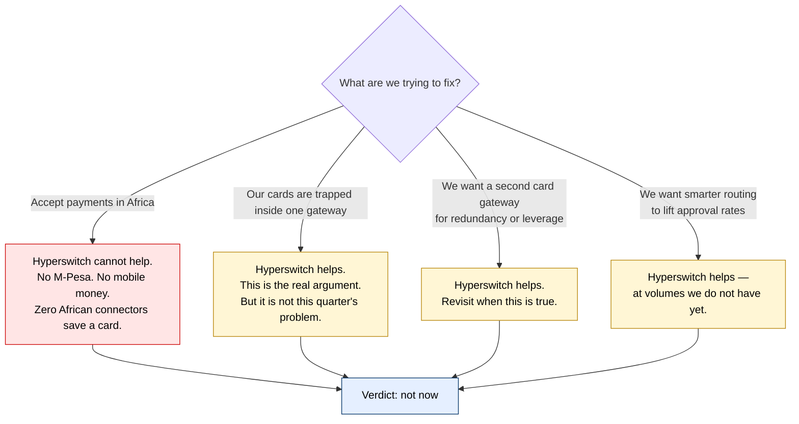

---

## Where it sits

### Today

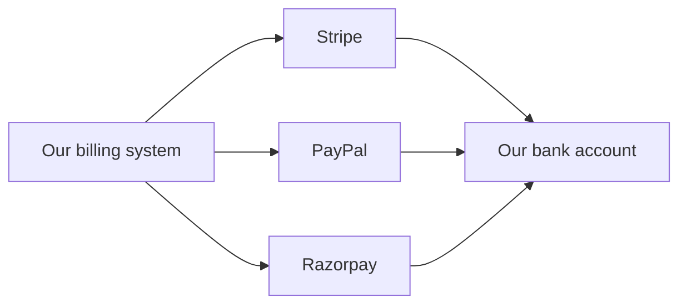

### With Hyperswitch

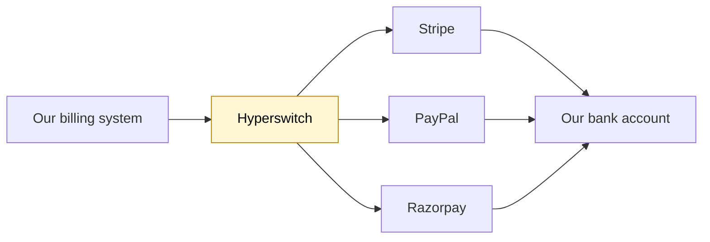

The money path is unchanged. Hyperswitch never holds our funds — the gateway still
settles into our account. Only the API calls move.

---

## What we would have to run

If we self-host, every one of these sits in the path of every payment.

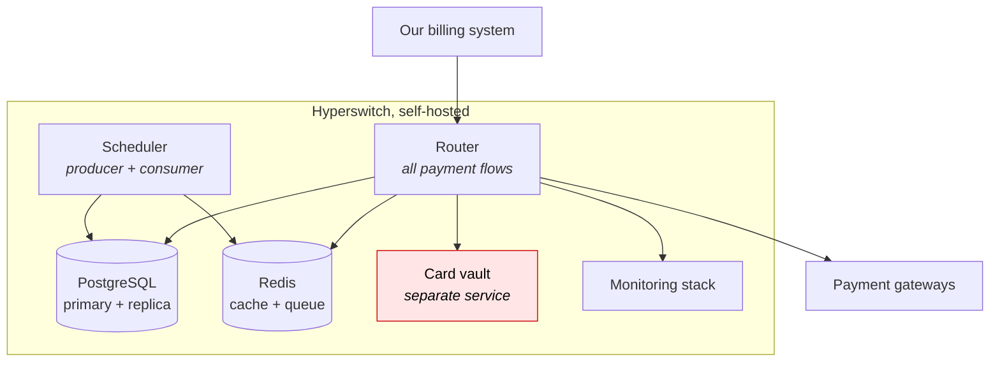

The card vault is shaded because it is the piece with legal consequences: the moment
real card numbers live in something we operate, we own that obligation.

---

## The connector inventory

149 modules ship in the tree. They are not all payment gateways.

| What it is | Count | Examples |
|---|---:|---|
| Payment gateway | 98 | Stripe, Adyen, Checkout, Razorpay |
| Bank acquirer | 9 | JP Morgan, Wells Fargo, Santander |
| Alternative payment method | 6 | Amazon Pay, BitPay, Boku |
| Billing platform | 2 | Chargebee, Recurly |
| Payout processor | 1 | Hyperwallet |
| Authentication provider | 1 | Plaid |
| Not a gateway at all | 32 | fraud, tax, 3DS servers, vaults, test stubs |

So the number that will actually take a card payment is nearer **100 than 149**.

### How production-ready are they?

| Status | Count | Share |
|---|---:|---|
| Live | 37 | ████████░░░░░░░░░░ 25% |
| Sandbox | 44 | █████████░░░░░░░░░ 30% |
| Beta | 11 | ██░░░░░░░░░░░░░░░░ 7% |
| Alpha | 21 | ████░░░░░░░░░░░░░░ 14% |
| No label | 36 | ███████░░░░░░░░░░░ 24% |

Read the "no label" row carefully. Stripe is in it, and Stripe is their most complete
connector. The labels are inconsistently filled in — which tells you something about
how the edges of this project are maintained.

**Only about a third of payment gateways are marked production-ready.**

### Can they save a card for later?

This is the capability we actually need, and it is the exception, not the rule.

| | Count |
|---|---:|
| Connectors that can save a card on *at least one* payment method | 47 of 149 |
| Individual "yes, can save" declarations across all methods | 168 |
| Individual "no, cannot save" declarations | 298 |

---

## Country coverage

**Hyperswitch does not support countries. Gateways do.**

Their public API declares a `supported_countries` field. It is never filled in,
anywhere in the codebase. The only country list that exists is one *we* supply,
saying where we want to accept a given method.

| Region | Coverage | Notes |
|---|---|---|
| 🇺🇸 🇨🇦 🇬🇧 🇪🇺 🇦🇺 | ●●●●● | Cards plus dozens of local schemes |
| Latin America | ●●●●○ | Six separate Pix variants for Brazil alone |
| Southeast Asia | ●●●●○ | Five Indonesian virtual-account types |
| Japan | ●●●○○ | Five convenience-store chains |
| India | ●●○○○ | One connector, sandbox-only, cannot save cards |
| **Africa** | **●○○○○** | **Cards in South Africa. Nothing else.** |

### Africa in detail

| Connector | Country | Status | Methods | Can save a card? |
|---|---|---|---|---|
| Peach Payments | 🇿🇦 | Live | Cards | ❌ No |
| Absa / Sanlam | 🇿🇦 | Live | Debit order | ❌ No |
| Paystack | 🇳🇬 | Sandbox | Bank transfer | ❌ No |
| dLocal | multi | Sandbox | Cards, vouchers | — |
| Rapyd | multi | Sandbox | Cards, wallet | — |

**Not one African connector can save a card.**

And the payment methods that matter in Africa simply do not exist. Their list of
122 payment methods contains:

| Method | Present? |
|---|---|
| M-Pesa | ❌ |
| MTN Mobile Money | ❌ |
| Airtel Money | ❌ |
| Orange Money | ❌ |
| Wave | ❌ |
| "Momo" | ⚠️ **Yes — but it's the Vietnamese wallet, not MTN** |

---

## Can we store a card and charge it at month end?

**Yes. This is the thing it does best.** Their docs are explicit that the later
charge is *"not tied to a specific amount or cycle."* We would never touch their
subscription product.

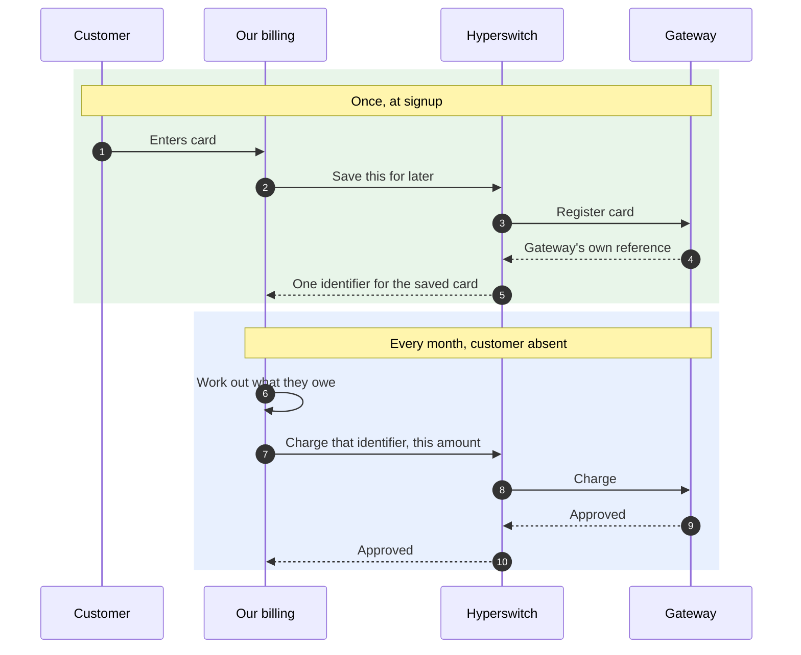

Clean. No caveats worth the ink — **for cards**. Almost nothing else in the world
can be charged silently later, and that is a fact about payment methods, not about
Hyperswitch.

---

## If a card fails on one gateway, does it try another?

**This is the most oversold part of the product.**

A saved card is not one thing. Internally it is a *map*, one entry per gateway:

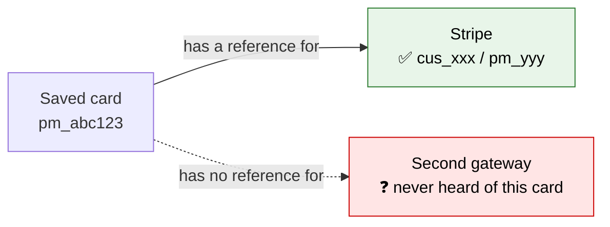

The reference Stripe gave us means nothing to any other gateway. So when the retry
fires, here is what actually has to be true:

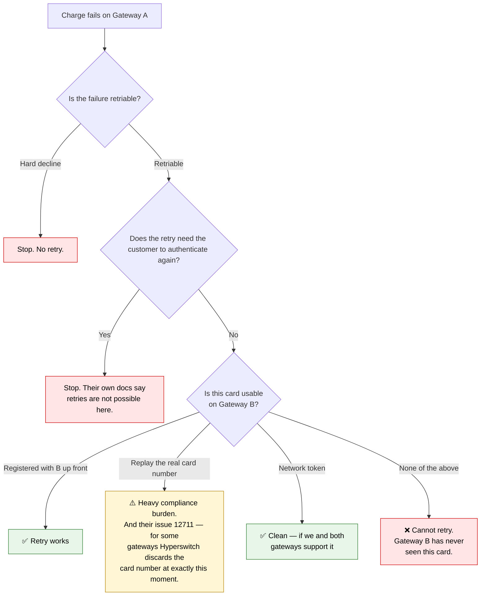

**Cross-gateway retry is real, but it is not free and it is not universal.**

---

## The two-of-everything problem

Adopting Hyperswitch means running a second copy of things we have already built.

| Capability | Hyperswitch has it | We have it | Result |
|---|:---:|:---:|---|
| Deciding which gateway to use | ✅ | ✅ | Duplicate |
| Retrying a failed payment | ✅ | ✅ | **Duplicate — dangerous** |
| Checking payments actually landed | ✅ | ✅ | Duplicate |
| Customer records | ✅ | ✅ | Duplicate |
| Subscriptions and invoices | ✅ | ✅ | Duplicate |
| Cost and approval reporting | ✅ | ~ | Overlap |
| **Holding card numbers portably** | ✅ | ❌ | **Genuinely new** |
| **Routing by cost or approval rate** | ✅ | ❌ | **Genuinely new** |
| **Selective 3D Secure** | ✅ | ❌ | **Genuinely new** |
| **~100 gateways pre-integrated** | ✅ | ❌ | **New, if we need breadth** |

### Why the duplicate retry is the scary one

Neither system knows the other exists.

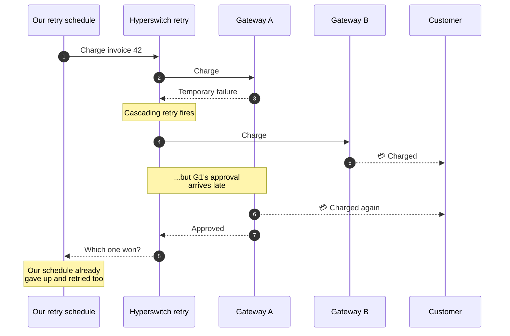

Both systems behaved exactly as designed. The customer was charged twice.

---

## One more hop, everywhere

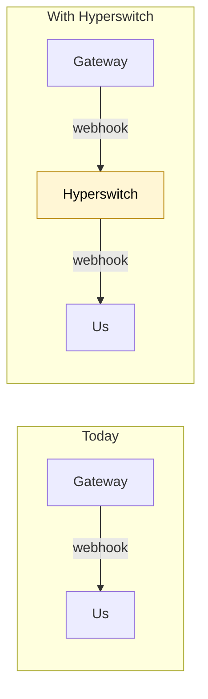

One more place a message can be delayed, duplicated or lost. One more signature to
verify. And our records now carry Hyperswitch's identifiers while the *money*
settled against the gateway's — so proving a customer paid means joining across both.

---

## Scorecard

| | Direct gateways | Hyperswitch |
|---|---|---|
| Cost to add gateway #4 | A few hundred lines of code | A form — *if* a connector exists |
| Cost to add M-Pesa | Write it ourselves | Write it in someone else's Rust, or wait |
| Things we operate | Nothing extra | Service, DB, Redis, vault, monitoring |
| Single point of failure | The gateway | The gateway **and** Hyperswitch |
| Card portability | ❌ Locked to Stripe | ✅ The main prize |
| Smart routing | ❌ | ✅ |
| Failover between gateways | ❌ | ⚠️ Conditional |
| Records match the money | ✅ By construction | ⚠️ Needs a join |
| Duplicate retry risk | ✅ None | ❌ Real |
| Africa | ✅ We build it | ❌ Nothing there |
| Fix a broken gateway integration | Our codebase | Their codebase, their timeline |

---

## If we ever do adopt it

Adopt it *narrowly*. This is the shape that keeps the prize and drops most of the risk.

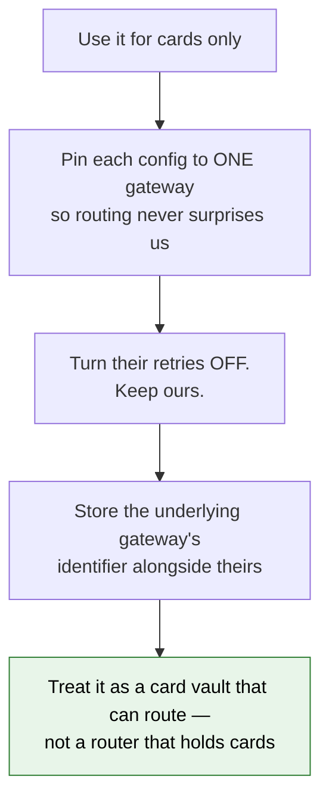

---

## The sequence I'd suggest

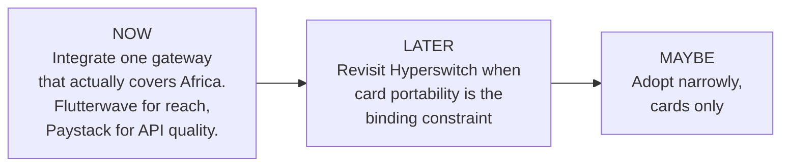

> **The trap to avoid:** adopting it *because* it has a hundred connectors, and then
> discovering that the two we need are the two that don't work.

---

## A footnote on Africa that no orchestrator changes

Mobile money is not a card. The customer approves each payment on their phone by
entering a PIN. There is no silent month-end pull — not through Hyperswitch, not
through anyone.

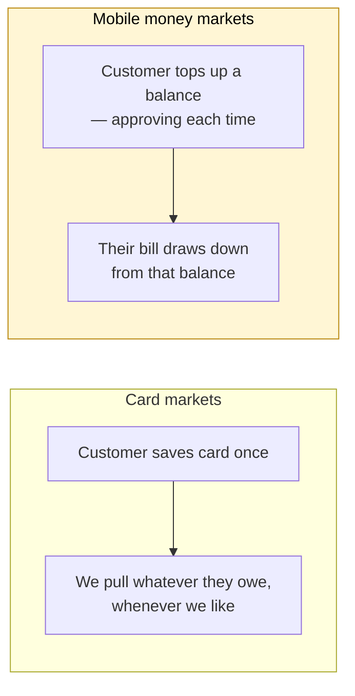

Whatever we build for Africa, it will be top-up-in-advance. That is a different
shape of billing, and choosing Hyperswitch or not does not affect it at all.
